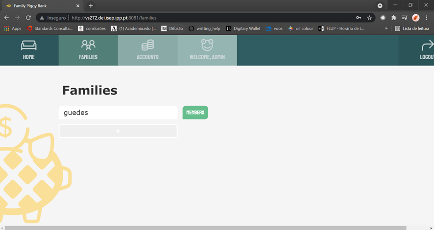

# DevOps - Group Assignment

> Apply DevOps to the Personal Finance Project.

---

# 1 Table of Content

1. [Project Setup](#2-project-setup)
2. [3 Tracks](#3-tracks)
3. [3.1 Tracks 1](#3.1-track-1)
4. [3.2 Tracks 2](#3.2-track-2)
5. [3.3 Tracks 3](#3.3-track-3)
6. [3.4 Tracks 4](#3.4-track-4)
7. [3.5 Tracks 5](#3.5-track-5)
8. [3.6 Tracks 6](#3.6-track-6)
9. [3.7 Tracks 7 & 8](#3.7-track-7-&8)

---

# 2 Project Setup

Before tackling the multiple tasks for this group assignment, there is some work to be done in the application itself.

To be able to deploy the application in different environments, we need to define some properties that can, in each task, be personalized. One of the obvious one is the location of the data base server.

## 2.1 Backend to Database connection

```console
src
├── main
│        ├── java
│        │        └── switchtwentytwenty ...
│        └── resources
│            ├── application-production-cloud.properties
│            ├── application-production-docker.properties
│            ├── application-production-vagrant.properties
│            └── application.properties
└── test
    ├── java
    │        └── switchtwentytwenty ...
    └── resources
        └── application.properties
```

Inside each _resource_ folder, for _main_ and _test_, there were new application properties created:

- __application-production-cloud.properties__ to connect with the database in the cloud, aka ISEP's virtual servers;

> spring.datasource.url=jdbc:h2:tcp://vs387.dei.isep.ipp.pt:9092/./jpadb

- __application-production-docker.properties__ to connect to the database container;

> spring.datasource.url=jdbc:h2:tcp://192.168.33.11:9092/./jpadb

- __application-production-vagrant.properties__ to connect to the virtual machine with the database server;

> spring.datasource.url=jdbc:h2:tcp://192.168.33.11:9092/./jpadb

- __application.properties__, in the _main_ and _test_ folder, to run the database server in memory.

> spring.datasource.url=jdbc:h2:mem:testdb

To specify which file to use during test, some lines needed to be added to the pom.xml:

```console
<testResources>
     <testResource>
        <directory>src/test/resources</directory>
     </testResource>
</testResources>
```

With these files we are now able to define during deployment to which database we want to connect.

In case we are using a .JAR file the command to run it needs to specify the application properties file:

```console
java -jar *.jar --spring.config.location=file:///root/config/application-production-cloud.properties
```

---

## 2.2 Frontend to Backend connection

The same strategy is applicable to the frontend component.

We first created the not-yet-existent _.env_ file to store all the environment variables.

```console
REACT_APP_URL_API=http://localhost:8080
```

The REACT_APP_URL_API is the variable that stores the location of the backend. By default, we are trying to connect to the `localhost:8080`.

During deployment, we can change this variable:

```console
REACT_APP_URL_API=http://vs430.dei.isep.ipp.pt:8080 npm run build
```

In this case above, we defined the variable as storing the address to the cloud server containing our backend.

---

# 3 Tracks

# 3.1 Track 1

> Local deployment of App with Ansible to Vagrant VMs - Track 1 and 2

The main goal for this assignment was to create Three Virtual Machines using a Vagrantfile: one that contains the backend of our application, a second one that holds our frontend, and a third one with the database. These machines are to be configured and managed with Ansible. On track 1 the Maven project deployed locally, and on track 2, the project converted previously to Gradle also was deployed locally.

## 3.1.1 Create a Vagrantfile to create Virtual Machines

On each track (1 and 2), a Vagrantfile was created in order to generate 4 Virtual Machines: one containing the backend (be), a second one the database (db), a third one the frontend (fe), and finally a fourth one containing ansible (ansible). For this assignment "[envimation/ubuntu-xenial](https://app.vagrantup.com/envimation/boxes/ubuntu-xenial)" box was used for every virtual machine.
On the top section of this file, we defined the settings common to every virtual machine:

            Vagrant.configure("2") do |config|
              config.vm.box = "envimation/ubuntu-xenial"

              # This provision is common for both VMs
              config.vm.provision "shell", inline: <<-SHELL
                sudo apt-get update -y
                sudo apt-get install iputils-ping -y
                sudo apt-get install -y avahi-daemon libnss-mdns
                sudo apt-get install -y unzip
                sudo apt-get install openjdk-8-jdk-headless -y
                sudo apt-get install python3 --yes
                # ifconfig
              SHELL

The "iputils" is necessary in order to ping other virtual machines to check the connection between them. Python 3 was also installed because Ansible will need to use it.

After that, we need to define the specific configurations of the database VM:

            config.vm.define "db" do |db|
                db.vm.box = "envimation/ubuntu-xenial"
                db.vm.hostname = "db"
                db.vm.network "private_network", ip: "192.168.33.11"

                # We want to access H2 console from the host using port 8082
                # We want to connect to the H2 server using port 9092
                db.vm.network "forwarded_port", guest: 8082, host: 8082
                db.vm.network "forwarded_port", guest: 9092, host: 9092

                # We need to download H2
                db.vm.provision "shell", inline: <<-SHELL
                  wget https://repo1.maven.org/maven2/com/h2database/h2/1.4.200/h2-1.4.200.jar
                SHELL

                # To connect to H2 use: jdbc:h2:tcp://192.168.33.11:9092/./jpadb
                db.vm.provision "shell", :run => 'always', inline: <<-SHELL
                  java -cp ./h2*.jar org.h2.tools.Server -web -webAllowOthers -tcp -tcpAllowOthers -ifNotExists > ~/out.txt &
                SHELL
              end

The database VM has the following IP address:192.168.33.11. The other virtual machines will have IP addresses in the same network. The jar file of the h2 also is downloaded to this virtual machine. Port 8082 accesses the h2 console, and we can use port 9092 to connect to the h2 server.
Next, the following configurations were used for the backend VM:

    config.vm.define "be" do |be|
        be.vm.box = "envimation/ubuntu-xenial"
        be.vm.hostname = "be"
        be.vm.network "private_network", ip: "192.168.33.10"

    # We set more ram memmory for this VM
    be.vm.provider "virtualbox" do |v|
      v.memory = 1024
    end

    # We want to access tomcat from the host using port 8080
                be.vm.network "forwarded_port", guest: 8080, host: 8080

                be.vm.provision "shell", inline: <<-SHELL, privileged: false
                  sudo apt install tomcat8 -y
                  sudo apt install tomcat8-admin -y
                  # If you want to access Tomcat admin web page do the following:
                  # Edit /etc/tomcat8/tomcat-users.xml
                  # uncomment tomcat-users and add manager-gui to tomcat user
                SHELL

              end

Tomcat, a web server, was installed in this machine. An IP address of the same network was chosen for this VM. The RAM for this VM also was set in this file to help some future steps run more smoothly.
To configure the last virtual machine, the one that contains the frontend of our project:

                 config.vm.define "fe" do |fe|
                    fe.vm.box = "envimation/ubuntu-xenial"
                    fe.vm.hostname = "fe"
                    fe.vm.network "private_network", ip: "192.168.33.12"
                  # We set more ram memmory for this VM
                    fe.vm.provider "virtualbox" do |v|
                    v.memory = 1024
                  end


                 # We want to access http server from the host using port 80
                    fe.vm.network "forwarded_port", guest: 80, host: 80

                    fe.vm.provision "shell", inline: <<-SHELL, privileged: false
                      sudo apt-get install nodejs -y
                      sudo apt-get install npm -y
                      sudo ln -s /usr/bin/nodejs /usr/bin/node
                      sudo apt-get install apache2 -y
                    SHELL

                  end

In this VM, apache, an HTTP server was installed. Node and npm also were installed. Once again, an IP address was attributed to this VM in the same network.
The configurations specific to the last VM that contains Ansible are as follows:

```
    config.vm.define "ansible" do |ansible|
    ansible.vm.box = "envimation/ubuntu-xenial"
    config.vm.provider "virtualbox" do |v|
      v.memory = 2048
    end
    ansible.vm.hostname = "ansible"
    ansible.vm.network "private_network", ip: "192.168.33.13"

    # For some Windows and for running ansible "inside" jenkins
    # ansible.vm.synced_folder ".", "/vagrant", mount_options: ["dmode=777,fmode=777"]
    # It seems that ansible has security issues with the previous command. Use instead:
    ansible.vm.synced_folder ".", "/vagrant", mount_options: ["dmode=775,fmode=600"]

    # For acessing jenkins in 8081
    ansible.vm.network "forwarded_port", guest: 8080, host: 8081

    ansible.vm.provision "shell", inline: <<-SHELL
      sudo apt-get install -y --no-install-recommends apt-utils
      sudo apt-get install software-properties-common --yes
      sudo apt-add-repository --yes --u ppa:ansible/ansible
      sudo apt-get install git-all --yes
      sudo apt-get install nodejs --yes
      sudo apt-get install ansible --yes
      # For jenkins
      sudo wget http://mirrors.jenkins.io/war-stable/latest/jenkins.war
      sudo java -jar jenkins.war
    SHELL
  end

end
```

In this VM, we installed Jenkins and Ansible. For this VM, once again, the IP address set is in the same network. The "mount_options" permissions are needed because Jenkins and Ansible are running on the same machine.

## 3.1.3 Running the VM

In the folder containing the Vagrantfile, the following command was issued to start the VMs:

    vagrant up

This command will launch the four virtual machines configured in the Vagrantfile.

## 3.1.4 Check the VM's connection

After running the command displayed above, the virtual machines are now running. To check if this is indeed the case, the following command was used, and the succeeding result was displayed:

    vagrant status


Next, to test the connection between the different virtual machines, we went inside ansible VM and tried to connect with the different virtual machines. For instance to check the connection with the db we write 'ping' and the db's IP:

    ping 192.168.33.11


### 3.1.5 Create a Playbook and Hosts

A playbook file was created to describe all the tasks that Ansible is to execute on a certain number of computers. Ansible performs all of the playbook's tasks on said number of computers that are defined as "hosts" and are specified in the "hosts" field. In this case, the hosts are the three other virtual machines (backend, frontend, and DB) created with the Vagrantfile. After performing those tasks, a report is issued.

Another file is used to define the host's IP addresses and credentials. This file is named 'hosts' and has the following content:

            [devopsservers]
            db ansible_ssh_host=192.168.33.11 ansible_ssh_port=22 ansible_ssh_user=vagrant ansible_ssh_pass=vagrant
            backend ansible_ssh_host=192.168.33.10 ansible_ssh_port=22 ansible_ssh_user=vagrant ansible_ssh_pass=vagrant
            frontend ansible_ssh_host=192.168.33.12 ansible_ssh_port=22 ansible_ssh_user=vagrant ansible_ssh_pass=vagrant

Going back to out Playbook file, first we define the tasks for our _db host_ where we :

1 - Update _apt cache_ and install jdk

            -name: update apt cache
            apt: update_cache=yes
            - name: install jdk
             apt: name=openjdk-8-jdk-headless state=present

2- Create a directory, in case it does not exist, and then remove the h2 jar files

            - name: create a directory if it does not exist
                  ansible.builtin.file:
                    path: /usr/src/app
                    state: directory
                - name: remove h2 jar files
                  ansible.builtin.file:
                    path: /usr/src/app/*.jar*
                    state: absent

3- Download h2 jar:

           - name: download h2 jar
                 get_url:
                   url: https://repo1.maven.org/maven2/com/h2database/h2/1.4.200/h2-1.4.200.jar
                   dest: /usr/src/app

4- Kill the h2 process and then start the h2 server

            - name: kill h2 process
                 shell: pkill -9 java
                 ignore_errors: yes
               - name: start h2 server
                 shell: nohup java -cp /usr/src/app/h2*.jar org.h2.tools.Server -web -webAllowOthers -tcp -tcpAllowOthers -ifNotExists </dev/null >/dev/null 2>&1 &

Next, we define the tasks for our _backend host_ where we:

1- Update the apt cache and install jdk

            - name: update apt cache
                apt: update_cache=yes
            - name: install jdk
                apt: name=openjdk-8-jdk-headless state=present

2- Copy the jar file and the application properties file to the server

             - name: copy the jar file to server
                copy: src=../../build/libs/project-1.0-SNAPSHOT.jar dest=/home/
             - name: copy the application properties file to server
                copy: src=../../src/main/resources/application-production-vagrant.properties  dest=/home/

3- Kill the backend process

             - name: kill backend process
                  shell: pkill -9 java
                  ignore_errors: yes

4- Start the backend server

              - name: start backend server
                  shell: nohup java -jar /home/project-1.0-SNAPSHOT.jar --spring.config.location=file:///home/application-production-vagrant.properties </dev/null >/dev/null 2>&1 &

The dest folder indicates the destination folder on the VM. Ideally the path chosen would have been /var/lib/tomcat8/webapps . The reason as to why 'home' was chosen was because spring boot already uses Tomcat.

At the end, we specify the tasks for our _frontend host_ with the following:

1- Update apt cache and clean the frontend folder in the server

         - name: update apt cache
              apt: update_cache=yes
            - name: clean frontend folder in server
              ansible.builtin.file:
                path: /var/www/html/*
                state: absent

2- copy the frontend build folder to the server

        copy: src=../../frontend/build/  dest=/var/www/html/

## 3.1.6 Track 1 Creating a Jenkinsfile

This section refers to the Maven Project. As Maven was already part of the initial project, no conversion is needed. For the section containing information regarding the Gradle project, please refer to track 2.
By adding a specific Nodejs installation in Jenkins' Global Tool Configurations, we can use npm command by adding the following line to our script:

            tools {nodejs "node"}

1- The "Checkout" stage does the checkout of the git project. We define our checkout stage with our credentials from Bitbucket, and with the link to access our repository. The 'devops-repo-credentials' are a way to transmit credentials without specifying them in the Jenkinsfile:

      stages {
        stage('Checkout') {
            steps {
                echo 'Checking out...'
                git credentialsId: 'devops-repo-credentials', url: 'https://Ana_Gloria@bitbucket.org/BVSousa90/devops_g2.git'
            }
        }

2- the "Assemble" stages compile and produce the archive files. In the "Assemble Frontend" stage we erase the node_module folder, and subsequently, install the react dependencies and define the react app URL:

        stage('Assemble Backend') {
            steps {
                echo 'Assembling...'
                  script {
                    if (isUnix())
                        sh './mvnw package -Dmaven.test.skip=true'
                    else
                       bat './mvnw package -Dmaven.test.skip=true'
                    }
            }

             stage('Assemble Frontend') {
            steps {
                echo 'Assembling...'
                dir("frontend/"){
                    script{
                        sh 'rm -rf node_modules/; npm install; REACT_APP_URL_API=http://192.168.33.10:8080 CI=false npm run build'
                    }
                }
            }

3- Afterwards we settle our javadoc step, which will show the class and packages glossary:

```
  stage('Javadoc') {
            steps {
                    echo 'Generating javadoc report...'
                    script {
                     if (isUnix())
                        sh './mvnw javadoc:javadoc'
                     else
                       bat './mvnw javadoc:javadoc'
                publishHTML (target : [allowMissing: false,
                             alwaysLinkToLastBuild: true,
                             keepAll: true,
                             reportDir: 'target/site/apidocs/',
                             reportFiles: 'index.html',
                             reportName: 'JavaDoc Report',
                             reportTitles: 'The Report'])
                }
            }
```

4- Subsequently, the "Test" stage is the one that executes the Unit Tests and publishes its results in Jenkins, including coverage:

```
 stage('Test') {
            steps {
                    echo 'Testing...'
                    script {
                     if (isUnix())
                        sh './mvnw test'
                     else
                       bat './mvnw test'
                    }
                    junit 'target/surefire-reports/*.xml'
                    jacoco(execPattern: 'target/jacoco.exec')
                }
        }
```

5- The "Archive" stage is going to save to Jenkins the jar file produced in the assembling stage. In this case, what is saved is the jar file:

```
                 stage('Archive') {
            steps {
                echo 'Archiving...'
                archiveArtifacts 'target/*.jar'
            }
        }
```

6- The last stage consists of deploying the application locally:

```
      stage('Deploy') {
            steps {
                echo 'Deploying...'
                ansiblePlaybook(inventory: 'tracks/track1/hosts', playbook: 'tracks/track1/playbook.yml')
            }
        }
```

## 3.1.7 Running a pipeline on Jenkins

To open Jenkins, after running the VMs, we can go to the localhost set for the ansible VM:

    localhost:8081

Then it is necessary to sign up by inserting the name, email, and password. The default plugins are then installed.
Before starting the pipeline, other plugins must be added to Jenkins:

- **Nodejs** to be able to run the _npm_ command;
- **Jacoco** to publish the test coverage;
- **HTML Publisher** to pusblish the javadoc; and
- **Ansible** to handle the ansible stage.

For the _Nodejs_ plugin we need to set up some extra configurations by going to "Global Tool Configuration" and chose nodeJS options and chose version 16.1.0 .


By adding a specific _Nodejs_ installation in Jenkins' Global Tool Configurations, we are able to use `npm` command by adding the following line to our script:

```script
tools {nodejs "node"}
```

Before running the pipeline it is necessary to uncomment the following line on the file Ansible.cfg that is located on the etc/Ansible folder of the the Ansible VM:

    host_key_checking = False

This command avoids Ansible provisioning errors.

## 3.1.8 Pipeline Results

## 3.1.9 Javadocs

After running the pipeline, the following results were observed:


In the middle, the different stages of the builds can be observed. On the right-hand side the test results can be observed and on the let-hand side the number of buils is listed.

To observe the Jacoco reports, the last successful build was selected and on the right-hand side "Coverage report" was selected:


After running the pipeline, the Javadoc can not be observed due to Jenkins security issues. To bypass it, on the Jenkins "Script console" the following command was inserted:

    System.setProperty("hudson.model.DirectoryBrowserSupport.CSP", "")

Then another build was made and the following result were obtained by choosing "Javadoc report" on the left-hand side:


## 3.1.10 Local Deployment

After running the Pipeline, it is possible to access our application by typing the following URL in a browser:

    http://192.168.33.12/

This URL refers to the IP address set for the VM containing the frontend. To check if the VM that contains the frontend can communicate with the backend, it will suffice to go through the login process. If there is no communication or any other issue, the following message will appear:

    Unable to connect! Please try again or later.

After logging in, to check if the connection with the database is working, a new family was added:


Next, we type in the browser the URL containing the VM of the database and the port that accesses the h2-console:

    http://192.168.33.12/8082

on the JDBC URL field, the following was typed in, as can be seen in the image:

    jbdc:jdbc:h2:tcp://192.168.33.11:9092/./jpadb


This URL was specified in the application-production-vagrant.properties.
After hitting the 'Connect' button, it is possible to find the family added:


Another quick verification can be made by going inside the virtual machines and check for the files that were copied to each of them. As an example, we can go inside the frontend virtual machine by using the command:

    vagrant ssh fe

and inside the ' /var/www/html/' folder. There, we can find the index.html file copied to this folder:


This copy was a result of a task in the Playbook.

---

# 3.2 Track 2

> Gradle; local deployment of App with Ansible to Vagrant VMs

The main goal for this assignment was to create 3 Virtual Machines using a vagrantfile : one that contains the backend of our application, a second one that contains our frontend and a third one with the database. These machines are to be configured and managed with Ansible. 
On this track, the project converted previously to Gradle was also deployed locally.

This track was very similar to the previous track 1, there were no changes made to the _vagrantFile_, or to the _hosts_ so I will not repeat here
what was explained previously.
I will only explain where the tracks diverge.

## 3.2.1 Convert the project from maven to gradle 

To convert the project from maven to gradle, we used the gradle init command. 
The command reads the existing maven configuration file, pom.xml, and translates it to a build.gradle file.
The translation is not perfect. Some dependencies needed to be added to the file. After that we can have a project with two build tools.

## 3.2.2 Create a Jenkins File

To deploy our project on Jenkins it is required to generate a 

By adding a specific Nodejs installation in Jenkins' Global Tool Configurations, we are able to use npm command by adding the following line to our script:

            tools {nodejs "node"}

1- First we define our checkout stage with our credentials from Bitbucket, and with the link to access our repository. The example below was used in track2:

         git credentialsId: 'devops-repo-credentials', url: 'https://tiagoswitch@bitbucket.org/BVSousa90/devops_g2.git'

2- After that, we elucite the assemble backend step where we will run our bootJar from gradlew.  
With that purpose first we run the _sh ./gradlew clean_ and then _sh ./gradlew bootJar_

                    script {
                    if (isUnix()){
                        sh './gradlew clean'
                        sh './gradlew bootJar'
                    }
                    else
                    {
                       bat  './gradlew clean'
                       bat './gradlew bootJar'
                    }

3- Later we designate the script for assemble frontend, there for we describe the folder path,
then we erase the node_module folder subsquentily install the react dependencies and define the react app url:

                  stage('Assemble Frontend') {
                            steps {
                                echo 'Assembling...'
                                dir("frontend/"){
                                    script{
                                        sh 'rm -rf node_modules/; npm install; REACT_APP_URL_API=http://192.168.33.10:8080 CI=false npm run build'
                                    }
                                }
                            }
                        }

4- Afterwards we settle our javadoc step, which will show the class and packages glossary,

                  steps {
                   echo 'Generating javadoc report...'
                         script {
                             if (isUnix())
                                sh './gradlew javadoc'
                             else
                                bat './gradlew javadoc'
                             publishHTML (target : [allowMissing: false,
                                               alwaysLinkToLastBuild: true,
                                               keepAll: true,
                                               reportDir: 'build/docs/javadoc/',
                                               reportFiles: 'index.html',
                                               reportName: 'JavaDoc Report',
                                               reportTitles: 'The Report'])
                                  }
                              }
                          }

5- Subsequently we explain the Test stage, where we run the tests and build .xml with the tests results

                  script {
                            if (isUnix())
                              sh './gradlew test'
                            else
                               bat './gradlew test'
                               }
                              junit 'build/test-results/**/*.xml'
                              jacoco(execPattern: 'build/jacoco/test.exec')

                            }
                      }

To verify the tests and the coverage for your classes on the target folder

Then we have our archive stage where we archive our .jar on the build/libs folder:

                stage('Archive') {
                            steps {
                                echo 'Archiving...'
                                archiveArtifacts 'build/libs/*.jar'
                            }
                        }

to go to the target folder.

6- The last stage consists on deploying the application locally

                stage('Deploy') {
                            steps {
                                echo 'Deploying...'
                                ansiblePlaybook(inventory: 'tracks/track2/hosts', playbook: 'tracks/track2/playbook.yml')
                            }
                        }


## 3.2.3 Generate the Ansible playbook file 

Only a small amount changes were introduced in Ansible's playbook from track. 
During the configuration of the backend's server, the jar file copied from the host machine to the guest, has a new path.

The first host configured was the database one (db). 
The use of _become_ allows ansible to have the privileges of the root.
Then we can define a set of tasks that will be executed sequentially.

1 - Update _apt cache_ and install jdk with: 
        
             hosts: db
              become: yes
              tasks: 
            -name: update apt cache
            apt: update_cache=yes 
            - name: install jdk
             apt: name=openjdk-8-jdk-headless state=present   
           
             
2- Create a directory if it does not exist and then remove h2 jar files:  
   
            - name: create a directory if it does not exist
                  ansible.builtin.file:
                    path: /usr/src/app
                    state: directory
                - name: remove h2 jar files
                  ansible.builtin.file:
                    path: /usr/src/app/*.jar*
                    state: absent   

3- Download h2 jar with the following : 
           
           - name: download h2 jar
                 get_url:
                   url: https://repo1.maven.org/maven2/com/h2database/h2/1.4.200/h2-1.4.200.jar
                   dest: /usr/src/app

4- Kill the h2 process and then start the h2 server: 

            - name: kill h2 process
                 shell: pkill -9 java 
                 ignore_errors: yes   
               - name: start h2 server
                 shell: nohup java -cp /usr/src/app/h2*.jar org.h2.tools.Server -web -webAllowOthers -tcp -tcpAllowOthers -ifNotExists </dev/null >/dev/null 2>&1 &
                 
                 
                 
Next we define our _backend host_ where: 

1- Update the apt cache and install jdk:        

            - name: update apt cache
                apt: update_cache=yes
            - name: install jdk
                apt: name=openjdk-8-jdk-headless state=present

2-  Copy the jar file and the application properties file to server

             - name: copy the jar file to server
                copy: src=../../build/libs/project-1.0-SNAPSHOT.jar dest=/var/lib/tomcat8/webapps
             - name: copy the application properties file to server
                copy: src=../../src/main/resources/application-production-vagrant.properties  dest=/var/lib/tomcat8/webapps

3-  Kill backend process

             - name: kill backend process
                  shell: pkill -9 java
                  ignore_errors: yes

4- Start backend server

              - name: start backend server
                  shell: nohup java -jar /var/lib/tomcat8/webapps/project-1.0-SNAPSHOT.jar --spring.config.location=file:///var/lib/tomcat8/webapps/application-production-vagrant.properties </dev/null >/dev/null 2>&1 &


In the end we specify our _frontend host_ with the following:

1- Update apt cache and clean frontend folder in server

         - name: update apt cache
              apt: update_cache=yes
            - name: clean frontend folder in server
              ansible.builtin.file:
                path: /var/www/html/*
                state: absent

2- copy frontend build folder to server

        copy: src=../../frontend/build/  dest=/var/www/html/
        
As previously mentioned the vagrant file and host files are similar to the previous track and after we run 

        vagrant up
        
And the VM are create as we can see on the following :


## 3.2.4 Running a pipeline on Jenkins

To open Jenkins, after running the VMs, we can go to the localhost set for the ansible VM:

    localhost:8081

Then it is necessary to sign up by inserting the name, email, and password. The default plugins are then installed.
Before starting the pipeline, other plugins must be added to Jenkins:

- **Nodejs** to be able to run the _npm_ command;
- **Jacoco** to publish the test coverage;
- **HTML Publisher** to pusblish the javadoc; and
- **Ansible** to handle the ansible stage.

For the _Nodejs_ plugin we need to set up some extra configurations by going to "Global Tool Configuration" and chose nodeJS options and chose version 16.1.0 .


By adding a specific _Nodejs_ installation in Jenkins' Global Tool Configurations, we are able to use `npm` command by adding the following line to our script:

```script
tools {nodejs "node"}
```

Before running the pipeline it is necessary to uncomment the following line on the file Ansible.cfg that is located on the etc/Ansible folder of the the Ansible VM:

    host_key_checking = False

This command avoids Ansible provisioning errors.

## 3.2.5 Pipeline Results

After running the pipeline, the following results were observed:


In the middle, the different stages of the builds can be observed. On the right-hand side the test results can be observed and on the let-hand side the number of buils is listed.

To observe the Jacoco reports, the last successful build was selected and on the right-hand side "Coverage report" was selected:


## 3.2.6 Javadocs

After running the pipeline, the Javadoc can not be observed due to Jenkins security issues. To bypass it, on the Jenkins "Script console" the following command was inserted:

    System.setProperty("hudson.model.DirectoryBrowserSupport.CSP", "")

Then another build was made and the following result were obtained by choosing "Javadoc report" on the left-hand side:


## 3.2.7 Local Deployment

After running the Pipeline, it is possible to access our application by typing the following URL in a browser:

    http://192.168.33.12/

This URL refers to the IP address set for the VM containing the frontend. To check if the VM that contains the frontend can communicate with the backend, it will suffice to go through the login process. If there is no communication or any other issue, the following message will appear:

    Unable to connect! Please try again or later.

After logging in, to check if the connection with the database is working, a new family was added:


Next, we type in the browser the URL containing the VM of the database and the port that accesses the h2-console:

    http://192.168.33.12/8082

on the JDBC URL field, the following was typed in, as can be seen in the image:

    jbdc:jdbc:h2:tcp://192.168.33.11:9092/./jpadb


This URL was specified in the application-production-vagrant.properties.
After hitting the 'Connect' button, it is possible to find the family added:


Another quick verification can be made by going inside the virtual machines and check for the files that were copied to each of them. As an example, we can go inside the frontend virtual machine by using the command:

    vagrant ssh fe

and inside the ' /var/www/html/' folder. There, we can find the index.html file copied to this folder:


This copy was a result of a task in the Playbook.

## 3.2.8 Summary

Ansible is an IT automation engine written in Python. With Ansible it is possible to automate provisioning, orchestration, configuration management and deployment of applications.

Ansible Playbooks are written using YAML syntax, so that you have it in human-readable format and no complex knowledge is required to understand what it does.
In practice, you can pass your Ansible Playbooks to a third person and in couple of minutes he/she will have an idea how you manage provisioning for your product.

Vagrant is a virtual machine manager. It is easy to configure, and by default comes with support of the providers such as Docker, VirtualBox and VMware. The great thing about Vagrant is that you can use all modern provisioning tools (e.g Chef, Puppet, Ansible) to install and configure software on the virtual machine.

---

# 3.3 Track 3

> Maven; local smoke test of App with Docker containers; publish docker images; manually execute App in local containers

The purpose of this track is to run the application in local Docker containers and publish the created images in Docker Hub.
To check that everything is running as expected, we run local smoke tests.


In this report we will explain each step we took to reach the aforementioned goal.


## 3.3.1 Preparing the environment of the local machine

1. Open a command line and indicate the path to the project folder:

```
    cd C:\Users\raquelswitch\IdeaProjects\devops_g2
```

2. Type the following command to delete the folder target:

```
    mvn clean
```

3. To create the .jar file in the target folder:

```
    mvn package
```

4. Indicate the path to the frontend folder:

```
    cd C:\Users\raquelswitch\IdeaProjects\devops_g2\frontend
```

5. To install the dependencies in the local node_modules folder:

```
    npm install
```

_Note: By default, npm install will install all modules listed as dependencies in package.json._
*Note: By default, 'npm install' will install all modules listed as dependencies in package.json.*

6. To create a build directory:

```
    npm run build
```

## 3.3.2 Creating the Dockerfiles

For this project it was necessary to create three _Dockerfiles_, one for each service of the application, one for the database service, one for the frontend
service and another for backend.
So we created three folders, one for each file:
- database
- backend
- frontend

*Database Dockerfile*

In the database folder,and following the example of the database _Dockerfile_ that was used in _CA4_, the following _Dockerfile_ was added:

````
FROM ubuntu

RUN apt-get update && \
    apt-get install -y openjdk-8-jdk-headless && \
    apt-get install unzip -y && \
    apt-get install wget -y

RUN mkdir -p /usr/src/app

WORKDIR /usr/src/app/

RUN wget https://repo1.maven.org/maven2/com/h2database/h2/1.4.200/h2-1.4.200.jar

EXPOSE 8082
EXPOSE 9092

CMD java -cp ./h2-1.4.200.jar org.h2.tools.Server -web -webAllowOthers -tcp -tcpAllowOthers -ifNotExists
````


*Backend Dockerfile*

In the backend folder, the following file was added: 

````
FROM tomcat

RUN apt-get update -y

RUN apt-get install -f

RUN apt-get install openjdk-11-jdk-headless -y

#RUN apt-get install git -y

#RUN mkdir -p /tmp/target

ADD ./target/project-1.0-SNAPSHOT.jar /usr/local/tomcat/webapps/ --> (1)

ADD ./src/main/resources/application-production-docker.properties /root/

CMD java -jar /usr/local/tomcat/webapps/project-1.0-SNAPSHOT.jar --spring.config.location=file:///root/application-production-docker.properties --> (2)

EXPOSE 8080
````
Although the backend server is tomcat, we are not using it, using the project jar directly. It occurs because the jar of a spring boot project can start an embedded server and loads our app and, with this, handle requests.
Initially we tried to install _openjdk-8_, but we ran into some problems so _openjdk-11_ was installed instead. 

In step 1, is necessary to indicate where the _jar_ file is and where to move add it inside the container.
And in step 2, we run the jar file with the correct application properties.


*Frontend Dockerfile*

In the frontend folder, the following _Dockerfile_ was added: 

````
FROM httpd

RUN apt-get update -y

RUN apt-get install -f

#RUN apt-get install git -y

RUN apt-get install nodejs -y

RUN apt-get install npm -y

ADD ./frontend/build/ /usr/local/apache2/htdocs/ --> (1)

EXPOSE 80
````

For this service, an [_httpd-Apache_](https://hub.docker.com/_/httpd) was used and _nodejs_ and _npm_ were installed.

In step 1, we wanted all the files, and folders that were in our local machine on the _build_ folder, to be added to the folder _htdocs_ in the container.
However, this step was a challenge since it was only after some builds that we finally understood where, in the container, were our files being copy to.
In the early stages the path for the container folders that we had were the one used in the previous _Dockerfiles_, however because of the image that was used, the path had to be changed.

*Docker Compose*

In order to build the three images, we need to add a docker-compose.yml file in the folder /track3:

````
version: '3'
services:

  backend:
    build:
      context: ../../
      dockerfile: tracks/track3/backend/Dockerfile
    ports:
      - "80:8080"
    networks:
      default:
        ipv4_address: 192.168.33.10
    depends_on:
      - "database"

  database:
    build: database
    ports:
      - "8082:8082"
      - "9092:9092"
    volumes:
      - ./data:/usr/src/data
    networks:
      default:
        ipv4_address: 192.168.33.11

  frontend:
    build:
      context: ../../
      dockerfile: tracks/track3/frontend/Dockerfile
    ports:
      - "8081:80"
    networks:
      default:
        ipv4_address: 192.168.33.12
    depends_on:
      - "backend"

networks:
  default:
    ipam:
      driver: default
      config:
        - subnet: 192.168.33.0/24

````

In this file, different IP addresses were assigned,within the same private network, to the docker containers, in order for them to communicate.
We had to explicit indicate the path to the respective _dockerfile_ and changed the frontend port, so we could access port 8081 and see our web application.


## 3.3.3 Creating a pipeline on Jenkins

1. In the folder where jenkins.war is located, run the following command in order to start Jenkins:

````
    java -jar jenkins.war --httpPort=8087
````

*Note: Jenkins opens on port 8087 so there is no conflict with the backend running on port 8080.*


2. Create a new job of the pipeline type.

3. Enter the following script in the "Pipeline Script" section:


````
pipeline {
agent any

    tools {nodejs "node"}

    stages {
        stage('Checkout') {
            steps {
                echo 'Checking out...'
                git credentialsId: 'devops_credentials_raquel', url: ' https://rakellcsc@bitbucket.org/BVSousa90/devops_g2.git'
            }
        }
        stage('Assemble Backend') {
            steps {
                echo 'Assembling...'
                    script {
                    if (isUnix())
                        sh './mvnw package -Dmaven.test.skip=true'
                    else
                       bat './mvnw package -Dmaven.test.skip=true'
                    }
            }
        }
        stage('Assemble Frontend') {
            steps {
                echo 'Assembling...'
                dir("frontend/"){
                    script{
                        bat 'npm install'
                        bat 'set "REACT_APP_URL_API=http://localhost:80" CI=false && npm run build'
                    }
                }
            }
        }
        stage('Javadoc') {
            steps {
                    echo 'Generating javadoc report...'
                    script {
                     if (isUnix())
                        sh './mvnw javadoc:javadoc'
                     else
                       bat './mvnw javadoc:javadoc'
                publishHTML (target : [allowMissing: false,
                             alwaysLinkToLastBuild: true,
                             keepAll: true,
                             reportDir: 'target/site/apidocs/',
                             reportFiles: 'index.html',
                             reportName: 'JavaDoc Report',
                             reportTitles: 'The Report'])
                }
            }
        }

        stage('Test') {
            steps {
                    echo 'Testing...'
                    script {
                     if (isUnix())
                        sh './mvnw test'
                     else
                       bat './mvnw test'
                    }
                    junit 'target/surefire-reports/*.xml'
                    jacoco(execPattern: 'target/jacoco.exec')
                }
        }
        stage('Archive') {
            steps {
                echo 'Archiving...'
                archiveArtifacts 'target/*.jar'
            }
        }

        stage ('Docker Image'){
             steps{
                 echo 'Building and pushing Image...'
                 dir('tracks/track3'){
                     script{
                     bat "docker-compose build --no-cache"
                     bat "docker-compose up -d"

                docker.withRegistry('','devops_docker_raquel'){
                    bat "docker tag track3_frontend 1201777/devops_1201777:frontend_${env.BUILD_NUMBER}"
                    bat "docker push 1201777/devops_1201777:frontend_${env.BUILD_NUMBER}"
                    bat "docker tag track3_backend 1201777/devops_1201777:backend_${env.BUILD_NUMBER}"
                    bat "docker push 1201777/devops_1201777:backend_${env.BUILD_NUMBER}"
                    bat "docker tag track3_backend 1201777/devops_1201777:database_${env.BUILD_NUMBER}"
                    bat "docker push 1201777/devops_1201777:database_${env.BUILD_NUMBER}"
                        }
                    }
                }
             }
        }
    }
}
````

## 3.3.4 Analysing the Docker Image Stage

On the Docker Image stage, we have the command:

````
    docker-compose build --no-cache
````

This command does not use cache when building the image.

The following command

````
    docker-compose up -d
````

indicates the detached mode: Run containers in the background, print new container names.

After building the images locally, we have to push them to the Docker Hub. To do this, we have to enter the Docker Hub credentials (previously created).

#### Build Now and... Success!

## 3.3.5 Analysing the different stages results

#### Docker Image stage result

After successful build, you can view the images created locally:


And these images were posted on the Docker Hub:


#### Test stage result

On this stage the result of the tests is seen in the graphic created after the build of the pipeline:


#### Javadoc stage result

As we can see in the following screenshot, the plugin installed specifically for this stage, allows access to javadoc reports:


After clicking on the "HTML Javadoc Report" option, we have access to the reports.

#### Archiving stage result

The result of stage Archiving can be seen in Last Successful Artifacts:


## 3.3.6 Jenkinsfile

Now that we know that our script works, we need to add the Jenkinsfile to the folder /track3 with the previous script.

At Jenkins, we follow these steps:

1. Create a new Job of type Pipeline;

2. Select "Pipeline script from SCM" on the configurations.

3. Select the URL of your repository (https://rakellcsc@bitbucket.org/rakellcsc/devops-20-21-1201777).

4. Insert your BitBucket credentials id.

5. Specify the relative path for the Jenkinsfile ('tracks/track3/Jenkinsfile').


## 3.3.7 Smoke Test

Opening the browser with '_http://localhost:8081_':


And _H2_ console with '_http://localhost:8082/_':


---

# 3.4 Track 4

> Gradle - Execution of the App in Local Containers

The goal of this track is exactly the same as track 3's but using Gradle as a building tool. This track is very similar to track 3 so I will mention the differences throughout the steps.

## 3.4.1 Create Dockerfiles and docker-compose.yml

This step is the same as track 3. We have to create 3 docker files, one for frontend, another one for backend and another one for database. Just like track 3, these 3 files should be created in 3 specific packages within track 4.
 
To create these 3 dockerfiles you can use the ones from track 3 because they are the same. 

The same goes for the _docker-compose.yml_ file. This file is also the same in track 3 and track 4. The only difference is the build script of backend and frontend because we have to mention the location of our dockerfiles.

So in the backend and frontend scripts from track 3 do the following changes: 

````
  backend:
    build:
      context: ../../
      dockerfile: tracks/track3/backend/Dockerfile
    ports:
      - "80:8080"
    networks:
      default:
        ipv4_address: 192.168.33.10
    depends_on:
      - "database"

````
````
  frontend:
    build:
      context: ../../
      dockerfile: tracks/track3/frontend/Dockerfile
    ports:
      - "8081:80"
    networks:
      default:
        ipv4_address: 192.168.33.12
    depends_on:
      - "backend"
````
In dockerfile location in both scripts change to:

````
dockerfile: tracks/track4/backend/Dockerfile
````
````
dockerfile: tracks/track4/frontend/Dockerfile
````

## 3.4.2 Create Jenkins Pipeline

Although it also is a stage similar to track 3, we will need to do a couple of small changes because now we will use Gradle to build the project instead of Maven in track 3.

- Open Jenkins by running the command:

````
java -jar jenkins.war --httpPort=8087
````

- Create a new Pipeline for this project.

- Fill up the Advance options like so:

    1. Select _Pipeline Script from SCM_
    2. Put your repository URL. Mine is _https://TomasFurtado@bitbucket.org/BVSousa90/devops_g2.git_
    3. Put your credentials
    4. In _Script Path_ insert your track 4's Jenkinsfile path: _tracks/track4/Jenkinsfile_


- Make sure you have the following script in your Jenkinsfile

```
pipeline {
    agent any

    stages {
        stage('Checkout') {
            steps {
                echo 'Checking out...'
                git credentialsId: 'devops_tomas_credentials', url: 'https://TomasFurtado@bitbucket.org/BVSousa90/devops_g2.git'
            }
        }
        stage('Assemble Backend') {
            steps {
                echo 'Assembling...'
                    script {
                        if (isUnix()) {
                             echo 'gradle clean'
                             sh './gradlew clean'
                             echo 'gradle bootJar'
                             sh './gradlew clean bootJar'
                        }
                        else {
                            echo 'gradle clean'
                            bat './gradlew clean'
                            echo 'gradle bootJar'
                            bat './gradlew clean bootJar'
                        }
                    }
            }
        }
        stage('Assemble Frontend') {
            steps {
                echo 'Assembling...'
                dir("frontend/"){
                  script{
                    sh 'npm install; REACT_APP_URL_API=http://localhost:80 CI=false npm run build'
                   }
                }
            }
        }
        stage('Javadoc') {
                   steps {
                       echo 'Generating javadoc report...'
                          script {
                           if (isUnix())
                              sh './gradlew javadoc'
                           else
                             bat './gradlew javadoc'

                       publishHTML (target : [allowMissing: false,
                                    alwaysLinkToLastBuild: true,
                                    keepAll: true,
                                    reportDir: 'build/docs/javadoc/',
                                    reportFiles: 'index.html',
                                    reportName: 'JavaDoc Report',
                                    reportTitles: 'The Report'])
                       }
                   }
        }
        stage('Test') {
            steps {
                    echo 'Testing...'
                    script {
                     if (isUnix())
                        sh './gradlew test'
                     else
                       bat './gradlew test'
                    }
                    junit 'build/test-results/test/*.xml'
                    jacoco(execPattern: 'build/jacoco/test.exec')
                }
        }
        stage('Docker Image'){
            steps{
                echo 'Building and pushing Image...'
                dir('tracks/track4'){
                 script {
                    if (isUnix()) {
                        sh 'docker-compose build --no-cache'
                        sh 'docker-compose up -d'
                        echo "build number: ${env.BUILD_NUMBER}"
                        docker.withRegistry('','devops_docker_credentials'){
                            echo 'Pushing front-end image...'
                            sh "docker tag track4_frontend tomasfurtado/devops_1201783:frontend_image_${env.BUILD_NUMBER}"
                            sh "docker push tomasfurtado/devops_1201783:frontend_image_${env.BUILD_NUMBER}"
                            echo 'Pushing back-end image...'
                            sh "docker tag track4_backend tomasfurtado/devops_1201783:backend_image_${env.BUILD_NUMBER}"
                            sh "docker push tomasfurtado/devops_1201783:backend_image_${env.BUILD_NUMBER}"
                            echo 'Pushing database image...'
                            sh "docker tag track4_database tomasfurtado/devops_1201783:database_image_${env.BUILD_NUMBER}"
                            sh "docker push tomasfurtado/devops_1201783:database_image_${env.BUILD_NUMBER}"
                        }
                    }
                    else {
                        echo 'docker-compose build'
                        bat 'docker-compose build --no-cache'
                        echo 'docker-compose up'
                        bat 'docker-compose up -d'
                        echo "build number: ${env.BUILD_NUMBER}"
                        docker.withRegistry('','devops_docker_jenkins'){
                            echo 'Pushing front-end image...'
                            bat "docker tag track4_frontend tomasfurtado/devops_1201783:frontend_image_${env.BUILD_NUMBER}"
                            bat "docker push tomasfurtado/devops_1201783:frontend_image_${env.BUILD_NUMBER}"
                            echo 'Pushing back-end image...'
                            bat "docker tag track4_backend tomasfurtado/devops_1201783:backend_image_${env.BUILD_NUMBER}"
                            bat "docker push tomasfurtado/devops_1201783:backend_image_${env.BUILD_NUMBER}"
                            echo 'Pushing database image...'
                            bat "docker tag track4_database tomasfurtado/devops_1201783:database_image_${env.BUILD_NUMBER}"
                            bat "docker push tomasfurtado/devops_1201783:database_image_${env.BUILD_NUMBER}"
                        }
                    }
                 }
               }
            }
        }
        stage('Archive') {
            steps {
                echo 'Archiving...'
                archiveArtifacts 'build/libs/*.jar'
            }
        }
    }
}
```

Now it's time to run the Pipeline!


As we can see, the build was successful! We can check the docker images in both the Docker application...


... as well as in docker Hub.


## 3.4.3 Smoke test


---

# 3.5 Track 5

> Maven; local smoke test of App with Docker containers; publish docker images; manually execute App in cloud containers

The main goal for this track was to, use our _Web Application - Family Piggy Bank_, the _Maven_ version, and to run each
service,
_frontend, backend and database_ in different _Cloud Containers_. The first step towards the main goal was to execute
each service in a different _Docker Container_.

This track was very similar to the previous track 3, there were no changes made to the _dockerfiles_ or to the _
docker-compose_, so I will not repeat here what was explained previously. I will only explain where the tracks diverge.

_1.Creating a pipeline_

After entering _Jenkins_ in my local machine, I created a new pipeline, named _Track 5_ and installed two new plugins, _
Jacoco_ plugin and _nodejs_. In the pipeline configuration I used the _Jenkinsfile_ that was in the repository on the
folder _tracks/track5_. In the following _Jenkinsfile_ where the (...) are, is where the stages are the same as the
previous _Jenkinsfiles_ (track 3 and 4).

```
pipeline {
    agent any

    stages {
        stage('Checkout') {
            steps {
                echo 'Checking out...'
                git credentialsId: 'devops-bitbucket-credenciais', url: 'https://BVSousa90@bitbucket.org/BVSousa90/devops_g2.git'
            }
        }
       (...)
        stage('Assemble Frontend') {
            steps {
                echo 'Assembling...'
                dir("frontend/"){
                    script{
                        sh 'npm install; REACT_APP_URL_API=http://192.168.33.10:8080 CI=false npm run build' --> (1)
                    }
                }
            }
        }
       (...)
       (...)
        stage('Building and pushing images'){
            steps{
                echo 'Building and pushing Image...'
                dir('tracks/track5'){
                    script{
                        sh 'docker-compose build --no-cache'
                        sh 'docker-compose up -d'
                        docker.withRegistry('', '1201761'){
                           sh "docker tag track5_frontend 1201761/devops2021:frontend_${env.BUILD_NUMBER}" --> tagging the image ...
                           sh "docker tag track5_backend 1201761/devops2021:backend_${env.BUILD_NUMBER}"
                           sh "docker tag track5_database 1201761/devops2021:database_${env.BUILD_NUMBER}"
                           sh "docker push 1201761/devops2021:frontend_${env.BUILD_NUMBER}" --> and pushing it to  my personal docker hub repository
                           sh "docker push 1201761/devops2021:backend_${env.BUILD_NUMBER}"
                           sh "docker push 1201761/devops2021:database_${env.BUILD_NUMBER}"
                        }
                    }
                }
            }
        }
        (...)
    }
}
```

In step 1, since I was running _Jenkins_ in my local machine, and my operating system is _Linux_, I was able to use the
npm command and set the environment variable differently. This step allows the override of the variable that was on the
project, and allows the communication between frontend and backend. As far as I understood, this variable points to the
backend 'virtual IP' (the one created on docker-compose), and the docker infrastructure forwards the request to the
right place.

After some failed builds, and some problems pushing the docker images to the docker hub repository, I was able, finally,
to have a successful build with the images pushed to docker hub.


After this, it was time to check if my application was ready, so in my browser searching for '_localhost:8081_':


And the _H2_ console, '_localhost:8082_':


In the _H2_ console, when using the url, that was defined in the application properties, I was able to access the
database.

_2.Smoke tests_

For this track, some smoke tests were executed manually such as:

--> Login into the app;

--> Creating a family with and without phone numbers;

--> Creating a family member, with and without phone numbers;

--> Checking the family profile, and the member profile;

--> Checking to see if all error messages were correct;

--> Checking if the database had the added family and members;

The images of some of these tests are presented in track 3.

This step was particular difficult since after a lot of research I was a little confused about which way to go, manual
smoke testing ou automatic smoke testing. In the case of automatic smoke tests, it was necessary to create a bash
script, and add another stage to the _Jenkins_ pipeline where the script was going to be used. And the smoke tests were
executed during the build. One example of a script/smoke test that could be in the jenkins stage is:

```
curl -o - http://myapplication/ --max-time 600  |  grep "Family Piggy Bank"
if [ $? -eq 0 ] ; then
    echo "Success"
    exit 0
else
    echo "Fail"
    exit 1
fi
```

In this example, it would check if the page was successfully built by looking for the expression "Family Piggy Bank" in
the application home page

_3.Creating a Server and preparing the environment_

The last part of this track was to execute the application in a cloud container. For this step I created a new server in
the _ISEP_ Network.


I choose this server because it already had _Docker_ support making my task easier. Before sending my docker-compose
file to the server I had to install _compose_, then I access the server through _sftp_ in order to send my
docker-compose.

```
sftp> lls --> to see where I am in my local machine
(...)
sftp> lcd --> to change the directory in my local machine, I have to be in the same folder as the docker-compose
(...)
sftp> put docker-compose.yml
Uploading docker-compose.yml to /root/docker/docker-compose.yml
docker-compose.yml                                          100%
sftp> ls --> to check if the docker-compose is in my server
```

After this I had to edit my file in order for it to use the docker images that I had push to the docker hub repository
in the previous step.

```
version: '3'
services:

  backend:
    image: 1201761/devops2021:backend_53
    ports:
      - "80:8080"
    networks:
      default:
        ipv4_address: 192.168.33.10
    depends_on:
      - "database"

  database:
    image: 1201761/devops2021:database_53
    ports:
      - "8082:8082"
      - "9092:9092"
    volumes:
      - ./data:/usr/src/data
    networks:
      default:
        ipv4_address: 192.168.33.11

  frontend:
    image: 1201761/devops2021:frontend_53
    ports:
      - "8081:80"
    networks:
      default:
        ipv4_address: 192.168.33.12
    depends_on:
      - "backend"

(...)

```

Then it was time to run the _docker-compose up_ command, all images were pulled from the repository, and the application
was initiated without any problems.

Opening the browser with '_http://vs464.dei.isep.ipp.pt:8081/_', I was able to see the main page of my app.

And _H2_ console with '_http://vs464.dei.isep.ipp.pt:8082/_':


When I tried to enter the application with the correct credentials, I always got the same message "Unable to connect".
As far as I understood, I could connect the frontend container with the backend.

So in the _Jenkinsfile_ I made a change in the "Assembling Frontend" stage:

```
  (...)
        stage('Assemble Frontend') {
            steps {
                echo 'Assembling...'
                dir("frontend/"){
                    script{
                        sh 'npm install; REACT_APP_URL_API=root@vs464.dei.isep.ipp.pt:80 CI=false npm run build'
                    }
                }
            }
        }
       (...)
```

My first option was to replace the IP address for the name of the service that receives the requests from frontend, in
my case "backend". For this I decided to create a new pipeline, and copied the script directly to _Jenkins_ and made the
necessary changes. The build was successful mas when running the app in the server, I couldn't connect to the backend.

My first option was to replace the IP address for the name of the service that receives the requests from frontend, in
my case "backend". For this I decided to create a new pipeline, and copied the script directly to _Jenkins_ and made the
necessary changes. The build was successful mas when running the app in the server, I couldn't connect to the backend.

Then, and for my final version, I tried using the address of my server, and the port where the backend was
running....Success!
I finally gained access to my app, and was able to enter, and add families and members that were added to the database
also.
Both _jenkinsfile_ ,for the new pipeline, and _docker-compose_ ,that I used in the server, are in the path _
track5/server_.

The last step was to stop the containers that were running in the server, and run the docker compose again but this time
with '_-d_' flag, '_docker-compose up -d_' , in order for the application to remain running in the server.

Ending this track.

---

## 3.6 Track 6

In this track, it is intended, from a Gradle project, to perform the Application's smoke tests locally of Docker Containers. Publish the images to a Docker Hub repository and manually place them in the working cloud using ISEP servers.

As explained above, the project was compartmentalized into 3 main parts, according to the three main components of the application, namely, frontend, backend, and database (database). Thus, in the first phase, it was necessary to create 3 Dockerfiles, each corresponding to each of these components, to create an image that, later, will create each respective container.

Each of these Dockerfiles contains in a corresponding package, to avoid entropy along the way. And, later, inside each package, the corresponding Dockerfile was placed. These created directories are found inside the track6 package. 
This entire procedure is very similar to the one developed in Track 3. However, since this is a Gradle project and not Maven, the location of the generated files is slightly different. Thus, in the case of the database and the frontend, the Dockerfile script is the same as the description in Track 3. In the case of the Backend, the script is below.

      ##Backend Dockerfile
    ####
    # create through tomcat environment
    FROM tomcat
    # update environment
    RUN apt-get update -y
    # intall ?
    RUN apt-get install -f
    # install java
    RUN apt-get install openjdk-11-jdk-headless -y
    # add jar to webapps directory
    ADD ./build/libs/project-1.0-SNAPSHOT.jar /usr/local/tomcat/webapps
    # add application-docker.properties to root directory
    ADD ./src/main/resources/application-production-docker.properties /root/
    # start application (with some configurations)
    CMD java -jar /usr/local/tomcat/webapps/project-1.0-SNAPSHOT.jar --spring.config.location=file:///root/application-production-docker.properties
    # define port
    EXPOSE 8080

In this case, as described above, this track also uses an appropriate application.properties file whose path is described at the end of the Dockerfile. As for the docker-compose.yml file, the one used in this part of the project is described below.
As can be seen, the main differences occur mainly at the level of paths used.

    version: '3'
    services:

    backend:
        build:
        context: ../../
        dockerfile: tracks/track6/backend/Dockerfile
        ports:
        - "80:8080"
        networks:
        default:
            ipv4_address: 192.168.33.10
        depends_on:
        - "database"

    database:
        build:
        context: ../../
        dockerfile: tracks/track6/database/Dockerfile
        ports:
        - "8082:8082"
        - "9092:9092"
        volumes:
        - ./data:/usr/src/data
        networks:
        default:
            ipv4_address: 192.168.33.11

    frontend:
        build:
        context: ../../
        dockerfile: tracks/track6/frontend/Dockerfile
        ports:
        - "8081:80"
        networks:
        default:
            ipv4_address: 192.168.33.12
        depends_on:
        - "backend"

    networks:
    default:
        ipam:
        driver: default
        config:
            - subnet: 192.168.33.0/24


In a subsequent phase, the Jenkins pipeline was also built, which is described below. Note that due to some problems with operating systems, the pipeline was built to be prepared to deal with Linux or Windows operating systems.

    pipeline {
        agent any

        stages {
            stage('Checkout') {
                steps {
                    echo 'Checking out...'
                    git credentialsId: 'devops_1201771_credentials', url: 'https://marciagds@bitbucket.org/BVSousa90/devops_g2.git'
                }
            }
            stage('Assemble Backend') {
                steps {
                    echo 'Assembling...'
                        script {
                            if (isUnix()) {
                                echo 'gradle clean'
                                sh './gradlew clean'
                                echo 'gradle bootJar'
                                sh './gradlew clean bootJar'
                            }
                            else {
                                echo 'gradle clean'
                                bat './gradlew clean'
                                echo 'gradle bootJar'
                                bat './gradlew clean bootJar'
                            }
                        }
                }
            }
            stage('Assemble Frontend') {
                steps {
                    echo 'Assembling...'
                        dir("frontend/"){
                            script{
                                if (isUnix()){
                                    echo 'npm install'
                                    sh 'npm install'
                                    echo 'build front-end package'
                                    sh "REACT_APP_URL_API=http://192.168.33.10:8080 CI=false npm run build"
                                    }
                                else {
                                    echo 'npm install'
                                    bat 'npm install'
                                    echo 'build front/end package'
                                    bat 'set "REACT_APP_URL_API=http://vs272.dei.isep.ipp.pt:80" CI=false && npm run build'
                                }
                            }
                        }
                }
            }
            stage('Javadoc') {
                steps {
                    echo 'Generating javadoc report...'
                    script {
                        if (isUnix())
                            sh './gradlew javadoc'
                        else
                        bat './gradlew javadoc'
                    echo 'Publishing javadoc report...'
                    publishHTML (target : [allowMissing: false,
                                alwaysLinkToLastBuild: true,
                                keepAll: true,
                                reportDir: 'build/docs/javadoc/',
                                reportFiles: 'index.html',
                                reportName: 'JavaDoc Report',
                                reportTitles: 'The Report'])
                    }
                }
            }

            stage('Test') {
                steps {
                        echo 'Testing...'
                        script {
                        if (isUnix())
                            sh './gradlew test'
                        else
                        bat './gradlew test'
                        }
                        junit 'build/test-results/test/*.xml'
                        jacoco(execPattern: 'build/jacoco/test.exec')
                    }
            }
            stage('Docker Image'){
                steps{
                    echo 'Building and pushing Image...'
                    dir('tracks/track6'){
                    script {
                        if (isUnix()) {
                            sh 'docker-compose build --no-cache'
                            sh 'docker-compose up -d'
                            echo "build number: ${env.BUILD_NUMBER}"
                            docker.withRegistry('','devops_docker_credentials'){
                                echo 'Pushing front-end image...'
                                sh "docker tag track6_frontend 1201771/devops_2021_1201771:frontend_${env.BUILD_NUMBER}"
                                sh "docker push 1201771/devops_2021_1201771:frontend_${env.BUILD_NUMBER}"
                                echo 'Pushing back-end image...'
                                sh "docker tag track6_backend 1201771/devops_2021_1201771:backend_${env.BUILD_NUMBER}"
                                sh "docker push 1201771/devops_2021_1201771:backend_${env.BUILD_NUMBER}"
                                echo 'Pushing database image...'
                                sh "docker tag track6_database 1201771/devops_2021_1201771:database_${env.BUILD_NUMBER}"
                                sh "docker push 1201771/devops_2021_1201771:database_${env.BUILD_NUMBER}"
                            }
                        }
                        else {
                            echo 'docker-compose build'
                            bat 'docker-compose build --no-cache'
                            echo 'docker-compose up'
                            //bat 'docker-compose up -d'
                            echo "build number: ${env.BUILD_NUMBER}"
                            docker.withRegistry('','devops_docker_credentials'){
                                echo 'Pushing front-end image...'
                                bat "docker tag track6_frontend 1201771/devops_2021_1201771:frontend_${env.BUILD_NUMBER}"
                                bat "docker push 1201771/devops_2021_1201771:frontend_${env.BUILD_NUMBER}"
                                echo 'Pushing back-end image...'
                                bat "docker tag track6_backend 1201771/devops_2021_1201771:backend_${env.BUILD_NUMBER}"
                                bat "docker push 1201771/devops_2021_1201771:backend_${env.BUILD_NUMBER}"
                                echo 'Pushing database image...'
                                bat "docker tag track6_database 1201771/devops_2021_1201771:database_${env.BUILD_NUMBER}"
                                bat "docker push 1201771/devops_2021_1201771:database_${env.BUILD_NUMBER}"
                            }
                        }
                    }
                }
                }
            }
            stage('Archive') {
                steps {
                    echo 'Archiving...'
                    archiveArtifacts 'build/libs/*.jar'
                }
            }
        }
    }
All stages described in the pipeline were built according to the same line of reasoning as Track 3. Furthermore, the smoke tests are also performed as described in Track 3 and Track 5, since it was the same process.

After all, images are correctly configured and accessible in the Docker Hub, the last phase of the task began. So, we started by creating a server from the services provided by ISEP, creating a server of type Ubuntu 20.04 LTS Focal (base system). This was selected since it already came with some pre-configurations when it was created, namely SSH and Docker, useful for the task in question. For this project, the server accessible through the link: [root@vs272.dei.isep.ipp.pt] was used.

After creating the server, it was then necessary to manually upload the existing Docker images in the Docker Hub (previously uploaded). To do this, we started by accessing the server via sftp and sending it the docker-compose.yml file described below. In this file, we have now configured the images, whose descriptions are those found in the Docker Hub, same as the Track 5.


    version: '3'
    services:

    backend:
        image: 1201771/devops_2021_1201771:backend_11
        ports:
        - "80:8080"
        networks:
        default:
            ipv4_address: 192.168.33.10
        depends_on:
        - "database"

    database:
        image: 1201771/devops_2021_1201771:database_11
        ports:
        - "8082:8082"
        - "9092:9092"
        volumes:
        - ./data:/usr/src/data
        networks:
        default:
            ipv4_address: 192.168.33.11

    frontend:
        image: 1201771/devops_2021_1201771:frontend_11
        ports:
        - "8081:80"
        networks:
        default:
            ipv4_address: 192.168.33.12
        depends_on:
        - "backend"

    networks:
    default:
        ipam:
        driver: default
        config:
            - subnet: 192.168.33.0/24

Finally, through sftp, it is necessary to send the new docker-compose.yml file to the server and then run it.

      $ sftp root@vs272.dei.isep.ipp.pt
    root@vs272.dei.isep.ipp.pt's password: ...
    Connected to vs272.dei.isep.ipp.pt.
    sftp> lcd [...]DevOps\projecto_g2\devops_g2\tracks\track6\server
    sftp> put docker-compose.yml
    sftp> exit

In the server, run the following command.

      $ docker compose up -d 



---

# 3.7 Track 7 & 8

## 3.7.1 Strategy to tackle the tracks 7 and 8

The method used to fullfil the requirements of this class assignment uses a kind of "divide and conquer" strategy.

Before thinking about Ansible or Jenkins, we deployed the application manually. After being certain that the application couldn't be the source of future problems, we focused on the next step.

So we created a _hosts_ file and used the `ansible` command to _ping_ all the hosts specified in the file. Connection confirmed!
After that we debugged the _playbook_ that would be run during the pipeline. For that, the `ansible-playbook` command was used locally.

The last step was to write a script for the Jenkins' pipeline.

All this small progressions assures a stable base for the next step and discards a lot of complexity during the debugging.

## 3.7.2 DEI Virtual Servers Private Cloud Setup

The deployment to the cloud is made to the ISEP's virtual servers.

There are multiple templates for these servers. The one that was chosen (n. 31) has Ubuntu 20.04 LTS (Focal) in a Linux container.


It comes with some pre-installed software packages:

- SSH service
- Apache 2.4 - HTTP/HTTPS server
- MySQL Server (v8.0.25)
- phpMyAdmin (MySQL Server management)
- PHP 7.4
- Java 11 (OpenJDK)
- NodeJS (v10.19.0)
- Perl, Python, gcc and make
- SWI-Prolog version 7.6.4

Some of the software are essential to answer the assignment. Python is recommended when the machine is managed by a control host through Ansible. The Apache server will be used for the frontend machine to handle the http traffic. And having Java and Node in the server reduces the necessary configurations in the Ansible's playbook.

Although the template includes some unnecessary software, it's the best suited for the job.

## 3.7.3 Control-Host setup

Our first approach to track 7 and 8 was to use one of ISEP's Virtual Server to install Jenkins and use it has the control host.

Unfortunately there were some performance issues that made this solution very difficult to use. The debugging of the scripts was very slow, more difficult and some errors had its source in the lack of memory of the machine.

The alternative was to create locally a virtual machine. To ensure some level of automation and reproducibility, we wrote a _Vagrantfile_ that specifies all the necessary requirements for this machine.

Here are some of the specifications:

- Python 3;
- Java Development Kit 8;
- Git;
- Ansible; and
- Jenkins

This VM is build with a Linux distribution as the operating system.

Another possible alternative would be to use a docker container, for instance, the official Jenkins docker image, or even build on top of this image and adding _Ansible_ or other dependencies.

## 3.7.4 Jenkins

Before starting the pipeline some plugins must be added to Jenkins:

- __Nodejs__ to be able to run the _npm_ command;
- __Jacoco__ to publish the test coverage;
- __HTML Publisher__ to pusblish the javadoc; and
- __Ansible__ to handle the ansible stage.

For the _Nodejs_ plugin we need to set up some extra configurations.


By adding a specific _Nodejs_ installation in Jenkins' Global Tool Configurations, we are able to use `npm` command by adding the following line to our script:

```script
tools {nodejs "node"}
```

## 3.7.5 Checkout stage

```jenkinsfile
stage('Checkout') {
    steps {
        echo 'Checking out...'
            git credentialsId: 'devops-repo-credentials', url: 'https://mendes-r@bitbucket.org/BVSousa90/devops_g2.git'
    }
}
```

In this stage we clone the git repository by defining its URL and the credential to access it.

The credential were predefined in Jenkins' Credential Manager. The credential's id is _devops-repo-credentials_.

## 3.7.6 Assemble Backend stage

```jenkinsfile
stage('Assemble Backend') {
    steps {
        echo 'Assembling Backend...'
        script {
            script {
                if (isUnix())
                    sh './mvnw package -Dmaven.test.skip=true'
                else
                    bat './mvnw package -Dmaven.test.skip=true'
            }
        }
    }    
}
```

During this stage we create a _.jar_ file to be subsequently deployed to a server.

Using the maven wrapper command (`mvnw`) with the sub-command `package`, we are able to create the file. The flag `-Dmaven.test.skip=true` disables the necessity to run the tests during this lifecycle phase.

This decision turns the pipeline quicker, however, has its drawbacks. Creating a package without running the tests can be dangerous, nevertheless, there are stages in this script that run the tests and assures that we only deploy the _jar_ file if the _test_ stage is successful.

The option to use an _if statement_ makes the script more inclusive in case it is running on a Windows machine.

## 3.7.7 Assemble Frontend stage

```jenkinsfile
stage('Assemble Frontend') {
    steps {
        echo 'Assembling...'
        dir("frontend/"){
            script{
                sh 'npm install; REACT_APP_URL_API=http://vs430.dei.isep.ipp.pt:8080 CI=false npm run build'
            }
        }
    }
}   
```

In this stage we create the necessary files to deploy our frontend component.

The _dir_ step defines a new working directory inside the cloned repository.
Inside the _frontend_ folder we run two commands: `npm install` and `npm run build`.

The first command installs all the necessary dependencies to run the frontend.

The second command is more complex. As already mentioned, all the environment variables of the frontend are defined in the _.env_ file. To edit this file for production we can redefine the variables.

The `REACT_APP_URL_API=http://vs430.dei.isep.ipp.pt:8080` changes the default variable's definition to the IP address of the backend server.

The second redefinition of a variable, tries to handle a problem that occurred during one of the first pipeline builds:

```console
Treating warnings as errors because process.env.CI = true.
Most CI servers set it automatically.
```

During the `npm run build` command some warning are thrown. In the pipeline they are handle as errors. To ignore them, we changed the _CI_ variable to false.

### ... other setback

```console
+ npm install
npm ERR! code EAI_AGAIN
npm ERR! syscall getaddrinfo
npm ERR! errno EAI_AGAIN
npm ERR! request to https://registry.npmjs.org/yocto-queue/-/yocto-queue-0.1.0.tgz failed, reason: getaddrinfo EAI_AGAIN registry.npmjs.org

npm ERR! A complete log of this run can be found in:
npm ERR!     /root/.npm/_logs/2021-06-27T23_19_54_498Z-debug.log
```

This error was sometimes thrown without a reason.
A possible source of this error is a bad internet connection. Given that we are running Jenkins inside a VM and that we need to have a VPN to access the ISEP's virtual servers we can conclude that the connection can be somewhat unstable.

## 3.7.8 Javadoc stage

```jenkinsfile
stage('Javadoc') {
    steps {
        echo 'Generating javadoc report...'
        script {
            if (isUnix())
                sh './mvnw javadoc:javadoc'
            else
                bat './mvnw javadoc:javadoc'

        publishHTML (target : [allowMissing: false,
            alwaysLinkToLastBuild: true,
            keepAll: true,
            reportDir: 'target/site/apidocs/',
            reportFiles: 'index.html',
            reportName: 'JavaDoc Report',
            reportTitles: 'The Report'])    
        }
    }      
}
```

In this stage we create and publish the _javadoc_.

The `./mvn javadoc:javadoc` command creates the files and the _publishHTML_ step publish the results in the Jenkins' GUI.

The _javadoc plugin_ in ours maven project that creates the _javadoc_ also throws some errors and warnings that can make the pipeline fail in this particular stage.

To change that, we need to add this lines to the _pom.xml_:

```pom
<plugin>
    <groupId>org.apache.maven.plugins</groupId>
    <artifactId>maven-javadoc-plugin</artifactId>
    <version>3.3.0</version>
    <configuration>
        <failOnError>false</failOnError>
    </configuration>
</plugin>
```

The _failOnError_ tag is now false.

Also, to view the published _javadoc_, we need to make a little tweak in our Jenkins.

This is needed because of the default content security policy. Jenkins applies restrictions to potentially untrusty files.

In the tab _Manage Jenkins_ we need to run the following script:

```console
System.setProperty("hudson.model.DirectoryBrowserSupport.CSP", "")
```


... to enable the visualization of the _javadoc_ files

## 3.7.9 Test stage

```jenkinsfile
stage('Test') {
    steps {
        echo 'Testing...'
        script {
            if (isUnix())
                sh './mvnw test'
            else
                bat './mvnw test'
            }
        junit 'target/surefire-reports/*.xml'
        jacoco(execPattern: 'target/jacoco.exec')
    }
}
```

To run the tests we use the `./mvnw test` command.

The _junit_ step handles the report and the _jacoco_ step the code coverage.


Both can be now be seen in the main Dashboard.

## 3.7.10 Archiving stage

```jenkinsfile
stage('Archive') {
    steps {
        echo 'Archiving...'
        archiveArtifacts 'target/*.jar'
    }
}
```

This stage was not asked for the class assignment, but was added as a debugging tool to assure that the correct file was created.

## 3.7.11 Deploy stage

```jenkinsfile
stage('Deploy') {
    steps {
        echo 'Deploying...'
        ansiblePlaybook(inventory: 'tracks/track7/hosts', playbook: 'tracks/track7/playbook.yml')
    }
}
```

The deployment stage uses the _Ansible_ plugin.

Here we just specify the path of the _hosts_ file and the path of the _playbook_. After that, and by running the build, Jenkins will use the `ansible-playbook` command to start the script inside the _playbook.yml_.

Some of the build failed during this stage with no known reason.

The console log showed the following lines:

```console
Deploying...
[Pipeline] ansiblePlaybook
[track-7] $ ansible-playbook tracks/track7/playbook.yml -i tracks/track7/hosts
FATAL: command execution failed
java.io.IOException: Cannot run program "ansible-playbook" (in directory "/var/jenkins_home/workspace/track-7"): error=2, No such file or directory
```

The error was somehow random or due to some strange occurrence. The missing files are in the right place. This was confirm using the `vagrant ssh` command to access the virtual machine that runs Jenkins.

The lack of memory in this late stage could be the problem.
A similar problem occurred during the _Assemble Frontend_ stage: a Node log file was missing.
Some research showed that because a possible solution was to add more RAM to the machine. The VM that throw that error had only 512MB of memory. After the "hardware" upgrade the error never turned up again.

## 3.7.12 Ansible

In this task, we aim to integrate Jenkins with ansible as already explored before in the VM setup point. Regarding ansible itself, having already installed it on VM, we had to create the ansible _playbook_ file. This file type is intended to record and perform all ansible functions related to configuration, deployment, and orchestration. Along with this file, we also created the host's file in which we set the three servers we had created using the isep virtualization platform:

```script
[devopsservers]
db ansible_ssh_host=vs387.dei.isep.ipp.pt ansible_ssh_port=22 ansible_ssh_user=root ansible_ssh_pass=CtH65bx5WQLF
backend ansible_ssh_host=vs430.dei.isep.ipp.pt ansible_ssh_port=22 ansible_ssh_user=root ansible_ssh_pass=Z5E0G+1YPVoY
frontend ansible_ssh_host=vs431.dei.isep.ipp.pt ansible_ssh_port=22 ansible_ssh_user=root ansible_ssh_pass=oOiJP02CRwt9
```

In this file, we define the host group as _devopsservers_ and then declare each of them. We set a designation (each will be used in the playbook), the URL and the server port, and also the access password. At this stage, the first difficulties arise, as we initially pretend to create a file to store each of the passwords. But ansible was unable to read them successfully. Thus, the current approach does not demonstrate great security as it arbitrarily exposes the passwords to access the servers, the ideal would be to have used ssh keys to access the servers, which despite having explored, we were also unable to complete.
To solve this, since ansible doesn't allow it, we had to uncomment the line _host_key_checking = False_ in the ansible configuration file in our VM _/etc/ansible/ansible.cfg_.

Regarding the playbook file:

```script
- hosts: db
  become: yes
  tasks: 
    - name: update apt cache
      apt: update_cache=yes 
    - name: install jdk
      apt: name=openjdk-8-jdk-headless state=present   
    - name: create a directory if it does not exist
      ansible.builtin.file:
        path: /usr/src/app
        state: directory
    - name: remove h2 jar files
      ansible.builtin.file:
        path: /usr/src/app/*.jar*
        state: absent    
    - name: download h2 jar
      get_url:
        url: https://repo1.maven.org/maven2/com/h2database/h2/1.4.200/h2-1.4.200.jar
        dest: /usr/src/app
    - name: kill h2 process
      shell: pkill -9 java 
      ignore_errors: yes   
    - name: start h2 server
      shell: nohup java -cp /usr/src/app/h2*.jar org.h2.tools.Server -web -webAllowOthers -tcp -tcpAllowOthers -ifNotExists </dev/null >/dev/null 2>&1 &
```

The first host configured was the database one (db). The use of _become_ allows ansible to have the privileges of the root user (or to define another user). Then we can define a set of tasks that will be executed sequentially. The first step, which is common to other hosts, was to update apt's cache. Then the server will download java's version 8 and install it. Since it is an h2 database, we define the folder _/usr/src/app_, which is created if it doesn't already exist on the server. With the folder created, ansible will check if our server has any jar file from h2 in there and remove it to download the available version in the next step. This step can be easily removed, since no changes are expected from the jar that is downloaded, and just download it on the first run. Then, any running java-related processes are terminated, which prevents that after a few executions of ansible we have different processes running h2 jar, something we didn't foresee at first. It was also necessary to use the ignore error annotation so that the playbook execution would not terminate if it did not find any java-related process to terminate. This process could also be optimized, just running a new process in the next step if none are running, but we ended up following the current approach. Regarding this last stage of running the jar, we had difficulties because even setting it to run in the background, the process ended when the ansible logout from the server. For that we had to add the _nohup_ command (meaning no hangup) which prevents the process terminates when the associated shell closes.

```script
- hosts: backend
  become: yes
  tasks:
    - name: update apt cache
      apt: update_cache=yes
    - name: install jdk
      apt: name=openjdk-8-jdk-headless state=present
    - name: copy the jar file to server
      copy: src=../../target/project-1.0-SNAPSHOT.jar dest=/root/ 
    - name: copy the application properties file to server
      copy: src=../../src/main/resources/application-production-cloud.properties  dest=/root/
    - name: kill backend process
      shell: pkill -9 java 
      ignore_errors: yes   
    - name: start backend server
      shell: nohup java -jar /root/project-1.0-SNAPSHOT.jar --spring.config.location=file:///root/application-production-cloud.properties </dev/null >/dev/null 2>&1 &
```

Regarding the backend host, it is very similar to explore above. In this case, we copy the jar file generated by jenkins during the project assemble and also the properties file related to these tracks. It also terminates the execution of java-related processes, avoiding having multiple backend executions in the server. Finally, the project's jar file is executed at the root level, using the defined properties file. Although the backend server is tomcat, we are not using it, using the project jar directly. It occurs because the jar of a spring boot project can start an embedded server and loads our app and, with this, handle requests.

```script
- hosts: frontend
  become: yes
  tasks:
    - name: update apt cache
      apt: update_cache=yes
    - name: clean frontend folder in server
      ansible.builtin.file:
        path: /var/www/html/*
        state: absent
    - name: copy frontend build folder to server
      copy: src=../../frontend/build/  dest=/var/www/html/
```

The last host configured was the frontend, being the simplest of the three. In this case, we removed the files included in the _/var/www/ html_ folder, because in the first approach we had conflicts in copying the files from the next step to the server. In this last step, we will then copy the files present in the build folder of the frontend that is generated by jenkins when assembling the frontend. We also had difficulty copying files since using a "*" or "." did not work as expected. The copy destination is important because it is the folder where the apache server reads the files.

Another situation we've explored a bit before is that it might not be necessary to constantly stop and start the database server with a new jar. Although we've checked that we don't lose persistence with this since the data file remains in the server.
We also thought about restarting the servers, and after a few tries, we couldn't get them to restart automatically without the server owner manually starting up.

## 3.7.12 Cloud deployment

After running the jenkins pipeline, we verified that the deployment was successful.


Looking at the jenkins console output regarding deployment, we can follow the steps that ansible performed:

```console
[Pipeline] ansiblePlaybook (hide)
[track7] $ ansible-playbook tracks/track7/playbook.yml -i tracks/track7/hosts

PLAY [db] **********************************************************************

TASK [Gathering Facts] *********************************************************
ok: [db]

TASK [update apt cache] ********************************************************
ok: [db]

TASK [install jdk] *************************************************************
ok: [db]

TASK [create a directory if it does not exist] *********************************
ok: [db]

TASK [remove h2 jar files] *****************************************************
ok: [db]

TASK [download h2 jar] *********************************************************
ok: [db]

TASK [kill h2 process] *********************************************************
changed: [db]

TASK [start h2 server] *********************************************************
changed: [db]

PLAY [backend] *****************************************************************

TASK [Gathering Facts] *********************************************************
ok: [backend]

TASK [update apt cache] ********************************************************
ok: [backend]

TASK [install jdk] *************************************************************
ok: [backend]

TASK [copy the jar file to server] *********************************************
ok: [backend]

TASK [copy the application properties file to server] **************************
ok: [backend]

TASK [kill backend process] ****************************************************
changed: [backend]

TASK [start backend server] ****************************************************
changed: [backend]

PLAY [frontend] ****************************************************************

TASK [Gathering Facts] *********************************************************
ok: [frontend]

TASK [update apt cache] ********************************************************
ok: [frontend]

TASK [clean frontend folder in server] *****************************************
ok: [frontend]

TASK [copy frontend build folder to server] ************************************
ok: [frontend]

PLAY RECAP *********************************************************************
backend                    : ok=7    changed=2    unreachable=0    failed=0    skipped=0    rescued=0    ignored=0   
db                         : ok=8    changed=2    unreachable=0    failed=0    skipped=0    rescued=0    ignored=0   
frontend                   : ok=4    changed=0    unreachable=0    failed=0    skipped=0    rescued=0    ignored=0 
```

We also check the three servers involved:

### Database server

We check for the h2 jar, the corresponding process and access the h2 console through the port provided:

```console
root@vs387:~# ls -al
...
-rw-r--r--  1 root root  2082 Jun 28 21:14 .h2.server.properties
-rw-r--r--  1 root root 57344 Jun 28 21:14 jpadb.mv.db
...
```

```console
root@vs387:/usr/src/app# ls -al
...
-rw-r--r-- 1 root root 2303679 Jun 24 08:59 h2-1.4.200.jar
```

```console
root@vs387:/usr/src/app# ps aux | grep java | grep -v grep
root     31790  0.0 28.9 2181112 75880 ?       Sl   21:10   0:09 java -cp /usr/src/app/h2-1.4.200.jar org.h2.tools.Server -web -webAllowOthers -tcp -tcpAllowOthers -ifNotExists
```


### Backend server

We check for the project jar, the corresponding process and that be able to respond to HTTP requests:

```console
root@vs430:~# ls -al
...
-rw-r--r--  1 root root 45572458 Jun 28 20:22 project-1.0-SNAPSHOT.jar
...
```

```console
root@vs430:~# ps aux | grep java | grep -v grep
root       86828  0.0 75.4 2222532 197884 ?      Sl   21:11   0:19 java -jar /root/project-1.0-SNAPSHOT.jar --spring.config.location=file:///root/application-production-cloud.properties
```


### Frontend server

We verified that the frontend files exist in the correct apache folder. After interacting with frontend page and insert a new member, we check that this data appears in the h2 console of the database server.

```console
root@vs431:/var/www/html# ls -al
...
-rw-r--r-- 1 root     root      1316 Jun 28 20:23 asset-manifest.json
-rw-r--r-- 1 root     root     15406 Jun 24 18:04 favicon.ico
-rw-r--r-- 1 root     root        29 Jun 27 13:52 .htaccess
-rw-r--r-- 1 root     root      3307 Jun 28 20:24 index.html
-rw-r--r-- 1 root     root      5347 Jun 24 18:04 logo192.png
-rw-r--r-- 1 root     root      9664 Jun 24 18:04 logo512.png
-rw-r--r-- 1 root     root       492 Jun 24 18:04 manifest.json
-rw-r--r-- 1 root     root        67 Jun 24 18:04 robots.txt
drwxr-xr-x 5 root     root      4096 Jun 24 18:04 static
```


## 3.7.13 Gradle

To convert the project from _maven_ to _gradle_, we used the `gradle init` command. The command reads the existing _maven_ configuration file, _pom.xml_, and translates it to a _build.gradle_ file. The translation is not perfect. Some dependencies needed to be added to the file. The interesting part is that a project can have multiple building tools coexisting without - apparently - having conflicts.

For track 8, the necessary modification are very specific.

In the _Jenkinsfile_ the following lines were updated:

- `./gradlew clean bootJar` replaces `./mvnw package -Dmaven.test.skip=true` in the _Assemble Backend_ stage.
- `./gradlew javadoc` replaces `./mvnw javadoc:javadoc` in the _Javadoc_ stage.
- The path to the _javadoc_ changed to `build/docs/javadoc/` instead of the previous `target/site/apidocs/`.
- `./gradlew test` replaces `./mvnw test` in the _Test_ stage.
- The path to the test results changed to `build/test-results/**/*.xml` instead of the previous `target/jacoco.exec`.
- In the _Archiving_ stage, the _jar_ file as na new location: `build/libs/*.jar`.

Also some small changes were introduced in _Ansible's_ playbook. During the configuration of the backend's server, the _jar_ file copied from the host machine to the guest, has a new path.

## 3.7.14 Summary

This alternative as some advantage in comparison to the other solutions.
The concept of running different systems in different devices is easier to grasp. To deploy container in the cloud or creating virtual machines inside a single machine, adds more levels of abstraction that can give more complexity to the orchestration.
The deployment to the cloud reduces the usage of resources in the local machine, usually the control host. Having the control host also in the cloud can turn the local machine in just an access point making the deployment painless.
Using a powerful tool as Ansible, enables us to concentrate in one place all the necessary configurations and access credentials to control a vast number of other machines.

There are also some disadvantage.
Ansible can be very sensible with the indentations of its scripts / playbooks.
In this particular case, where we use ISEP's virtual servers, the requirement to be connected to the network through a VPN,lowers the speed of the deployment and adds some variables to the process that can be confusing and frustrating.