# Track 3

> > Maven; local smoke test of App with Docker containers; publish docker images; manually execute App in local containers

The purpose of this track is to run the application in local Docker containers and publish the created images to Docker Hub.
To check that everything is running as expected, we run local smoke tests.


In this report we will explain each step we took to reach the aforementioned goal.


### 1. Preparing the environment of the local machine

1. Open a command line and indicate the path to the project folder:

````
    cd C:\Users\raquelswitch\IdeaProjects\devops_g2
````

2. Type the following command to delete the folder target:

````
    mvn clean
````

3. To create the .jar file in the target folder:

````
    mvn package
````

4. Indicate the path to the frontend folder:

````
    cd C:\Users\raquelswitch\IdeaProjects\devops_g2\frontend
````

5. To install the dependencies in the local node_modules folder:

````
    npm install
````

*Note: By default, npm install will install all modules listed as dependencies in package.json.*

5º To create a build directory:

````
    npm run build
````


### Dockerfiles

For this project, we need to create three dockerfiles: one for database, one for backend and one for frontend.

To do this, we should create three folders inside the folder /track3:

- database
- backend
- frontend

#### Database Dockerfile 

In the database folder, we need to create the following Dockerfile:

````
FROM ubuntu

RUN apt-get update && \
    apt-get install -y openjdk-8-jdk-headless && \
    apt-get install unzip -y && \
    apt-get install wget -y

RUN mkdir -p /usr/src/app

WORKDIR /usr/src/app/

RUN wget https://repo1.maven.org/maven2/com/h2database/h2/1.4.200/h2-1.4.200.jar

EXPOSE 8082
EXPOSE 9092

CMD java -cp ./h2-1.4.200.jar org.h2.tools.Server -web -webAllowOthers -tcp -tcpAllowOthers -ifNotExists
````


### Backend Dockerfile

In the backend folder, we need to create the following Dockerfile:

````
FROM tomcat

RUN apt-get update -y

RUN apt-get install -f

RUN apt-get install openjdk-11-jdk-headless -y

#RUN apt-get install git -y

#RUN mkdir -p /tmp/target

ADD ./target/project-1.0-SNAPSHOT.jar /usr/local/tomcat/webapps/

ADD ./src/main/resources/application-production-docker.properties /root/

CMD java -jar /usr/local/tomcat/webapps/project-1.0-SNAPSHOT.jar --spring.config.location=file:///root/application-production-docker.properties

EXPOSE 8080
````

### Frontend Dockerfile

In the frontend folder, we need to create the following Dockerfile:

````
FROM httpd

RUN apt-get update -y

RUN apt-get install -f

#RUN apt-get install git -y

RUN apt-get install nodejs -y

RUN apt-get install npm -y

ADD ./frontend/build/ /usr/local/apache2/htdocs/

EXPOSE 80
````

### Docker Compose

In order to build the three images, we need to add a docker-compose.yml file in the folder /track3:

````
version: '3'
services:

  backend:
    build:
      context: ../../
      dockerfile: tracks/track3/backend/Dockerfile
    ports:
      - "80:8080"
    networks:
      default:
        ipv4_address: 192.168.33.10
    depends_on:
      - "database"

  database:
    build: database
    ports:
      - "8082:8082"
      - "9092:9092"
    volumes:
      - ./data:/usr/src/data
    networks:
      default:
        ipv4_address: 192.168.33.11

  frontend:
    build:
      context: ../../
      dockerfile: tracks/track3/frontend/Dockerfile
    ports:
      - "8081:80"
    networks:
      default:
        ipv4_address: 192.168.33.12
    depends_on:
      - "backend"

networks:
  default:
    ipam:
      driver: default
      config:
        - subnet: 192.168.33.0/24

````

The configuration of the ports is in this file.

### Jenkins

1. In the folder where jenkins.war is, run the following command in order to start Jenkins:

````
    java -jar jenkins.war --httpPort=8087
````

*Note: Jenkins opens on port 8087 so there is no conflict with the backend running on port 8080.*


2. Create a new job of the pipeline type.

3. Enter the following script in the "Pipeline Script" section:

````
pipeline {
agent any

    tools {nodejs "node"}

    stages {
        stage('Checkout') {
            steps {
                echo 'Checking out...'
                git credentialsId: 'devops_credentials_raquel', url: ' https://rakellcsc@bitbucket.org/BVSousa90/devops_g2.git'
            }
        }
        stage('Assemble Backend') {
            steps {
                echo 'Assembling...'
                    script {
                    if (isUnix())
                        sh './mvnw package -Dmaven.test.skip=true'
                    else
                       bat './mvnw package -Dmaven.test.skip=true'
                    }
            }
        }
        stage('Assemble Frontend') {
            steps {
                echo 'Assembling...'
                dir("frontend/"){
                    script{
                        bat 'npm install'
                        bat 'set "REACT_APP_URL_API=http://localhost:80" CI=false && npm run build'
                    }
                }
            }
        }
        stage('Javadoc') {
            steps {
                    echo 'Generating javadoc report...'
                    script {
                     if (isUnix())
                        sh './mvnw javadoc:javadoc'
                     else
                       bat './mvnw javadoc:javadoc'
                publishHTML (target : [allowMissing: false,
                             alwaysLinkToLastBuild: true,
                             keepAll: true,
                             reportDir: 'target/site/apidocs/',
                             reportFiles: 'index.html',
                             reportName: 'JavaDoc Report',
                             reportTitles: 'The Report'])
                }
            }
        }

        stage('Test') {
            steps {
                    echo 'Testing...'
                    script {
                     if (isUnix())
                        sh './mvnw test'
                     else
                       bat './mvnw test'
                    }
                    junit 'target/surefire-reports/*.xml'
                    jacoco(execPattern: 'target/jacoco.exec')
                }
        }
        stage('Archive') {
            steps {
                echo 'Archiving...'
                archiveArtifacts 'target/*.jar'
            }
        }

        stage ('Docker Image'){
             steps{
                 echo 'Building and pushing Image...'
                 dir('tracks/track3'){
                     script{
                     bat "docker-compose build --no-cache"
                     bat "docker-compose up -d"

                docker.withRegistry('','devops_docker_raquel'){
                    bat "docker tag track3_frontend 1201777/devops_1201777:frontend_${env.BUILD_NUMBER}"
                    bat "docker push 1201777/devops_1201777:frontend_${env.BUILD_NUMBER}"
                    bat "docker tag track3_backend 1201777/devops_1201777:backend_${env.BUILD_NUMBER}"
                    bat "docker push 1201777/devops_1201777:backend_${env.BUILD_NUMBER}"
                    bat "docker tag track3_backend 1201777/devops_1201777:database_${env.BUILD_NUMBER}"
                    bat "docker push 1201777/devops_1201777:database_${env.BUILD_NUMBER}"
                        }
                    }
                }
             }
        }
    }
}
````

### Analysing the Docker Image Stage

No script existente na stage Docker Image, temos o comando: 

````
    docker-compose build --no-cache
````

This command does not use cache when building the image.

O comando seguinte

````
    docker-compose up -d
````

This is the detached mode: Run containers in the background, print new container names.

Depois de fazer build das imagens localmente, temos de fazer push para o Docker Hub. Para isso, temos de introduzir as credenciais do Docker Hub (criadas previamente).


### Build Now and... Success!

#### Build das imagens e push para o Docker Hub

Após o build com sucesso, é possível visualizar as imagens criadas localmente:

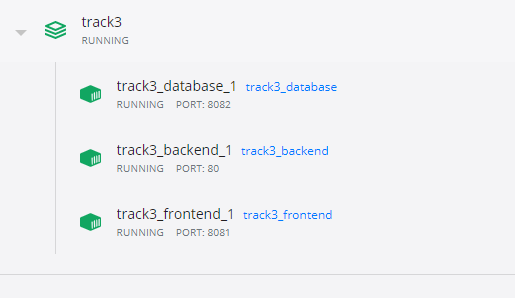

E publicadas no Docker Hub:

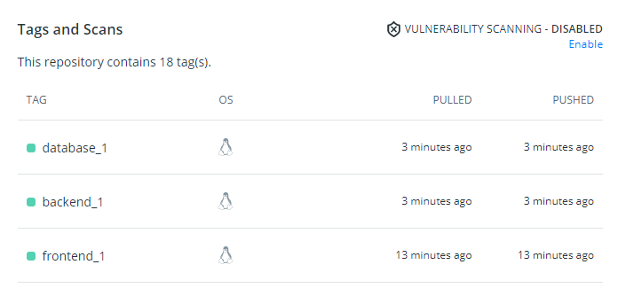


#### Resultado da Stage Test

On this stage the result of the tests is seen in the graphic created after the build of the pipeline:

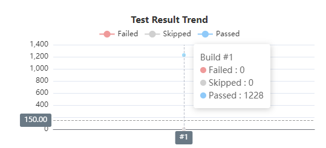

#### Resultado da Stage Javadoc

As we can see in the following screenshot, the plugin installed specifically for this stage, allows access to javadoc reports:

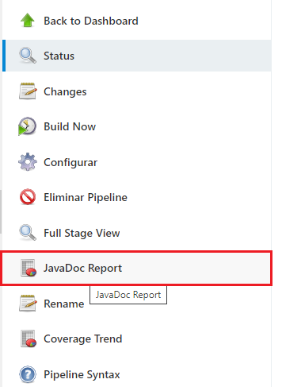

After clicking on the "HTML Javadoc Report" option, we have access to the reports.

#### Resultado da Stage Archiving

The result of stage Archiving can be seen in Last Successful Artifacts:

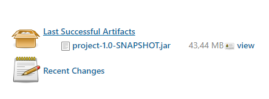


### Jenkinsfile

Agora que já comprovamos que o nosso script funciona, adicionamos o Jenkinsfile à pasta track3 com o script anterior.

No Jenkins, seguimos os seguintes passos:

1. Create a new Job of type Pipeline;


2. Select "Pipeline script from SCM" on the configurations.


2. Select the URL of your repository (https://rakellcsc@bitbucket.org/rakellcsc/devops-20-21-1201777).


3. Insert your BitBucket credentials id.


4. Specify the relative path for the Jenkinsfile ('tracks/track3/Jenkinsfile').


## Smoke Test

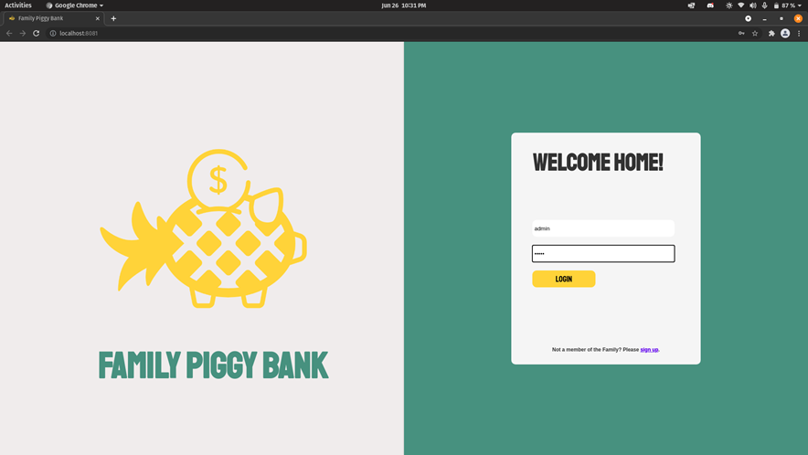

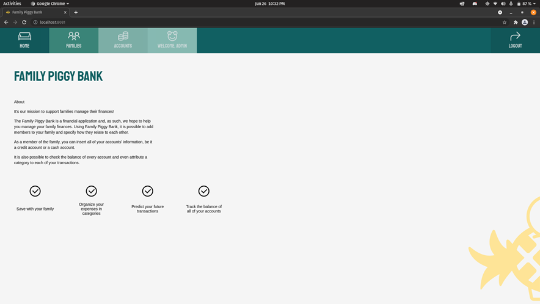

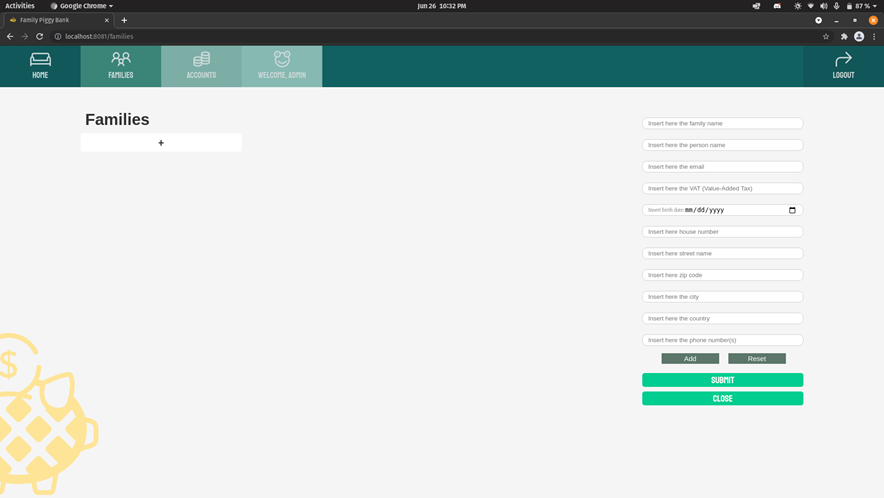

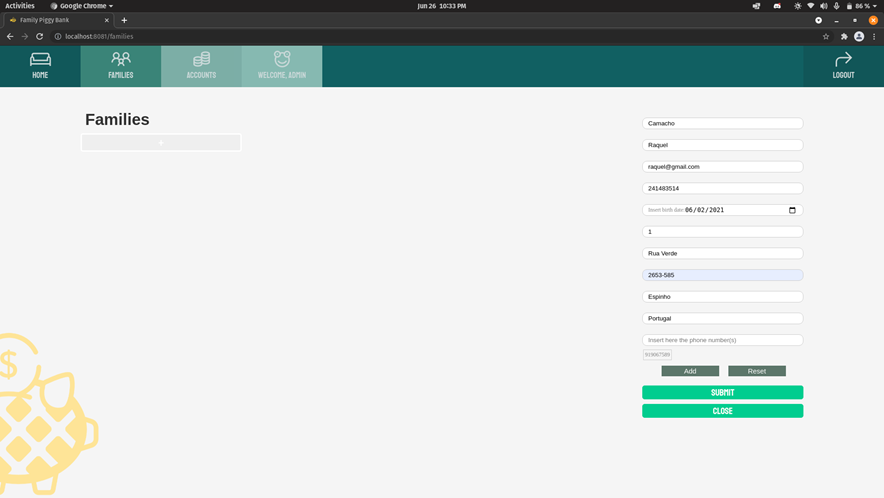

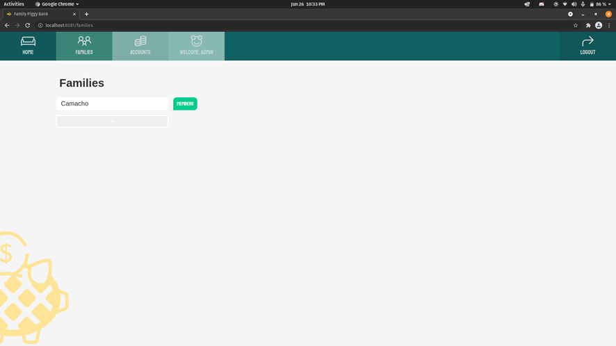

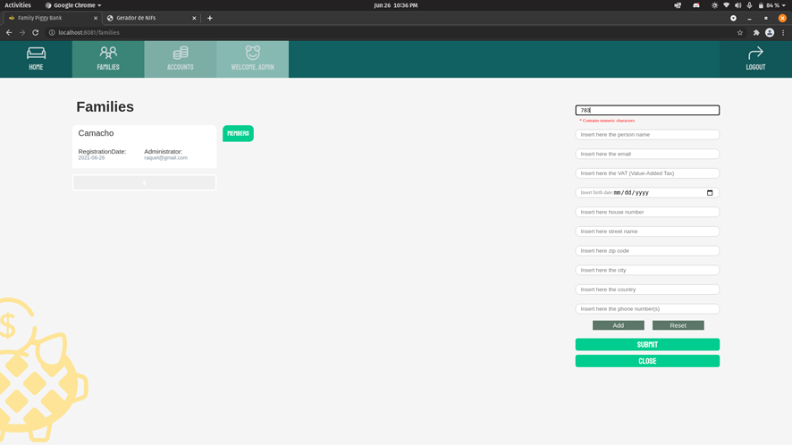

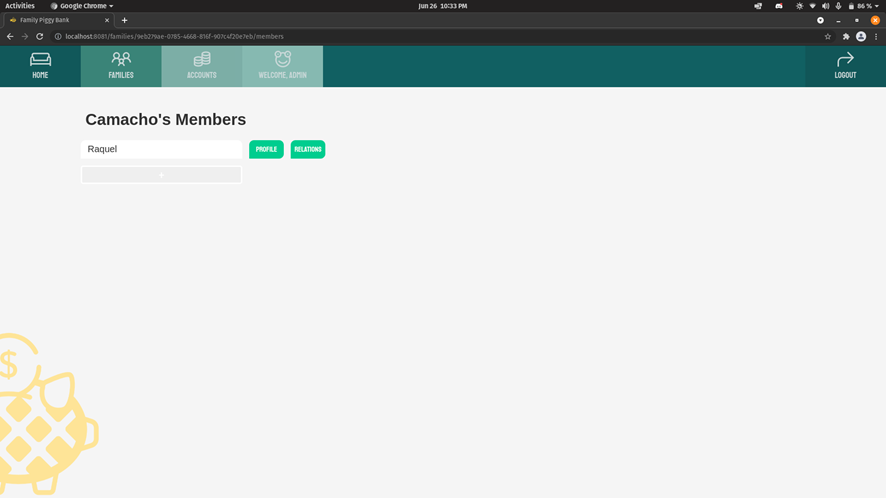

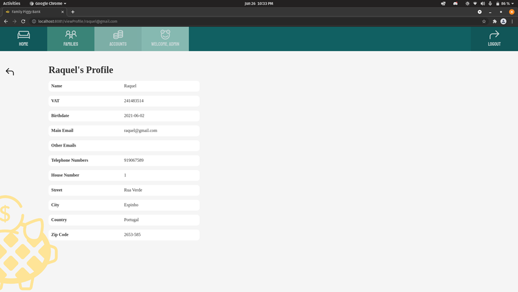

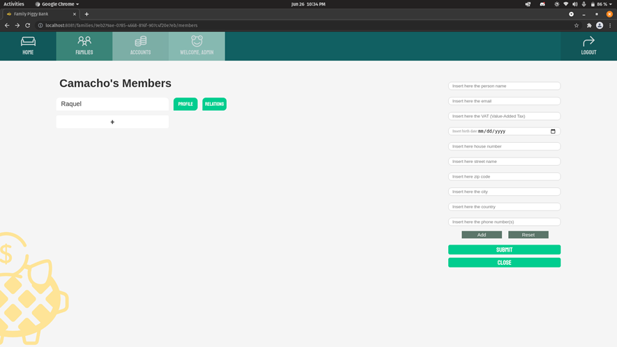

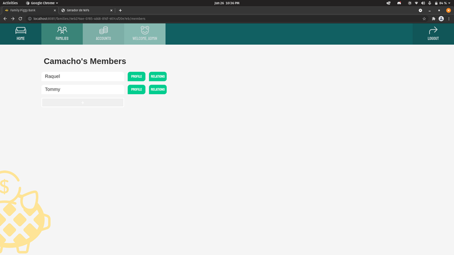

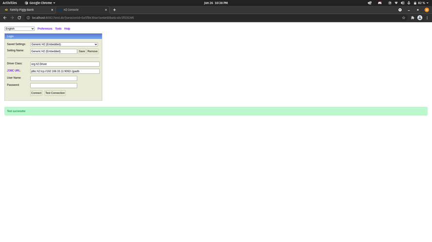

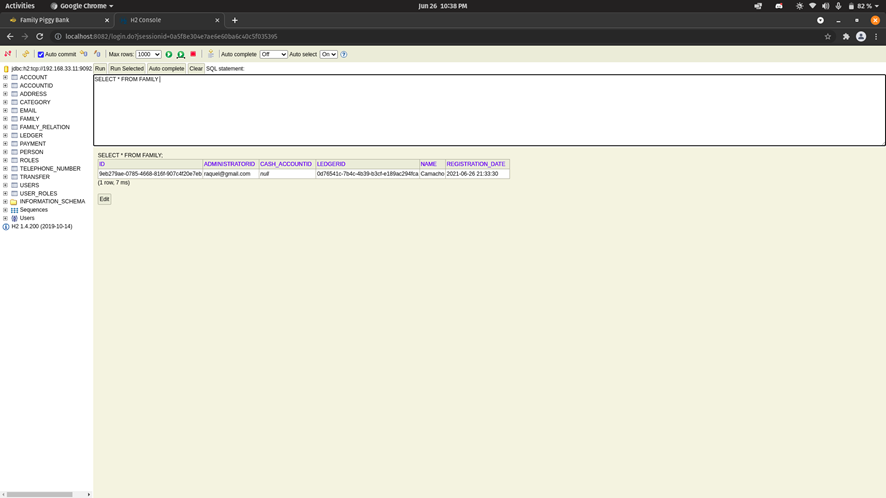

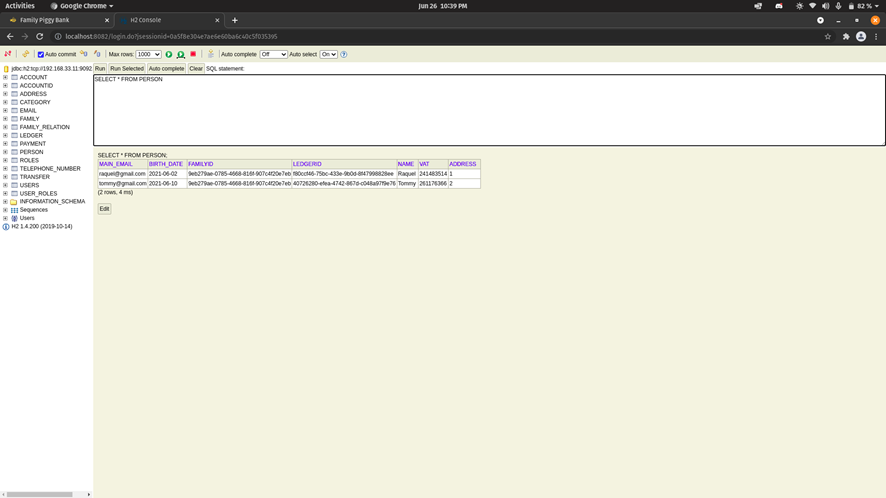


