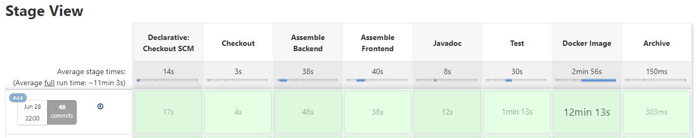
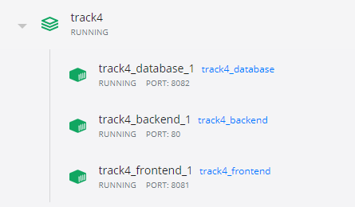
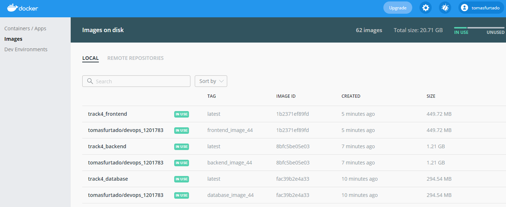
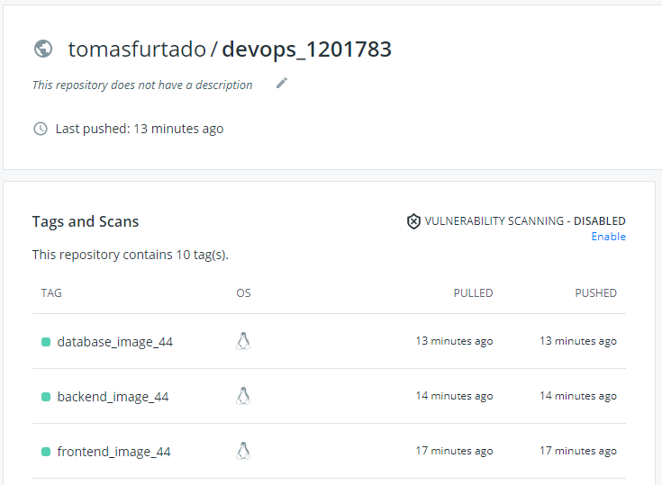
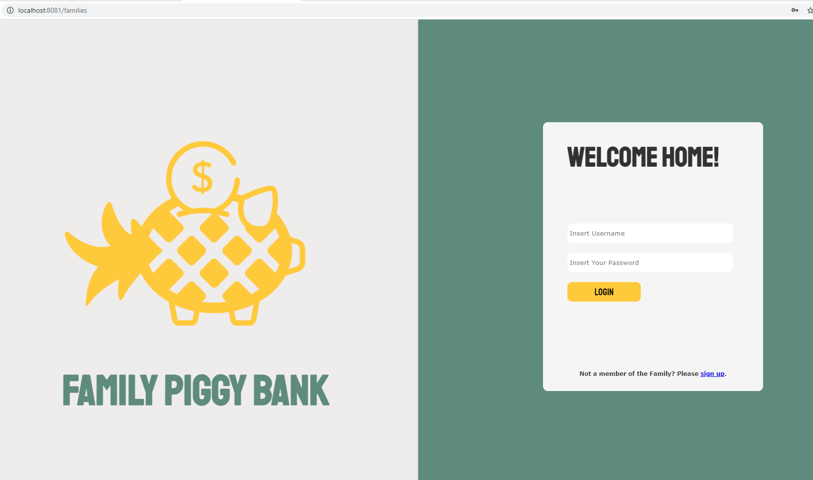
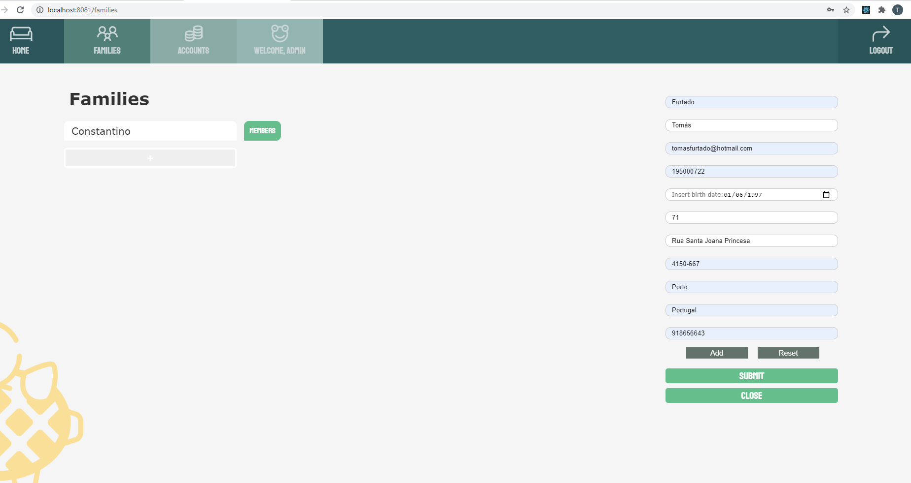
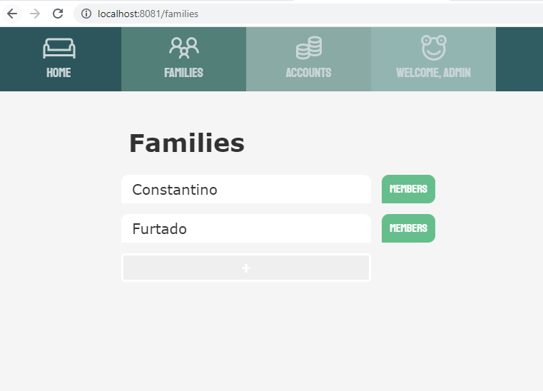
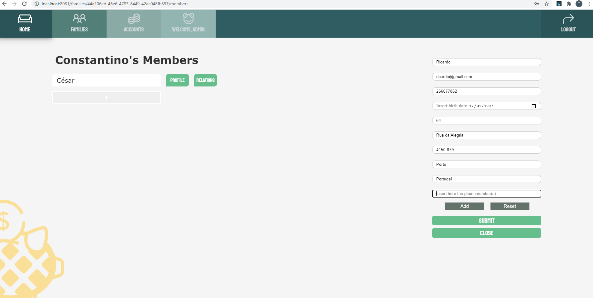
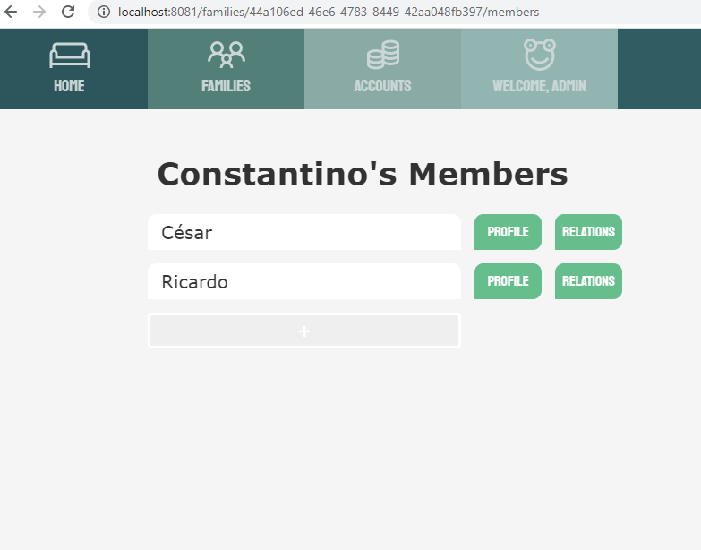
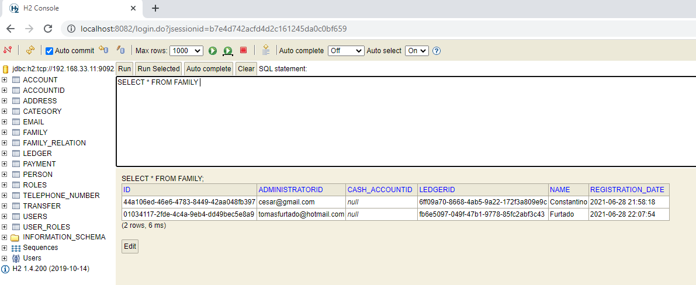

# Track 4 - Gradle Project - Execution of the App in Local Containers

The goal of this track is exactly the same as track 3's but using Gradle as a building tool. This track is very similar to track 3 so I will mention the differences throughout the steps.

## Create Dockerfiles and docker-compose.yml

This step is the same as track 3. We have to create 3 docker files, one for frontend, another one for backend and another one for database. Just like track 3, these 3 files should be created in 3 specific packages within track 4.
 
To create these 3 dockerfiles you can use the ones from track 3 because they are the same. 

The same goes for the _docker-compose.yml_ file. This file is also the same in track 3 and track 4. The only difference is the build script of backend and frontend because we have to mention the location of our dockerfiles.

So in the backend and frontend scripts from track 3 do the following changes: 

````
  backend:
    build:
      context: ../../
      dockerfile: tracks/track3/backend/Dockerfile
    ports:
      - "80:8080"
    networks:
      default:
        ipv4_address: 192.168.33.10
    depends_on:
      - "database"

````
````
  frontend:
    build:
      context: ../../
      dockerfile: tracks/track3/frontend/Dockerfile
    ports:
      - "8081:80"
    networks:
      default:
        ipv4_address: 192.168.33.12
    depends_on:
      - "backend"
````
In dockerfile location in both scripts change to:

````
dockerfile: tracks/track4/backend/Dockerfile
````
````
dockerfile: tracks/track4/frontend/Dockerfile
````

## Create Jenkins Pipeline

Although it also is a stage similar to track 3, we will need to do a couple of small changes because now we will use Gradle to build the project instead of Maven in track 3.

- Open Jenkins by running the command:

````
java -jar jenkins.war --httpPort=8087
````

- Create a new Pipeline for this project.

- Fill up the Advance options like so:

    1. Select _Pipeline Script from SCM_
    2. Put your repository URL. Mine is _https://TomasFurtado@bitbucket.org/BVSousa90/devops_g2.git_
    3. Put your credentials
    4. In _Script Path_ insert your track 4's Jenkinsfile path: _tracks/track4/Jenkinsfile_


- Make sure you have the following script in your Jenkinsfile

```
pipeline {
    agent any

    stages {
        stage('Checkout') {
            steps {
                echo 'Checking out...'
                git credentialsId: 'devops_tomas_credentials', url: 'https://TomasFurtado@bitbucket.org/BVSousa90/devops_g2.git'
            }
        }
        stage('Assemble Backend') {
            steps {
                echo 'Assembling...'
                    script {
                        if (isUnix()) {
                             echo 'gradle clean'
                             sh './gradlew clean'
                             echo 'gradle bootJar'
                             sh './gradlew clean bootJar'
                        }
                        else {
                            echo 'gradle clean'
                            bat './gradlew clean'
                            echo 'gradle bootJar'
                            bat './gradlew clean bootJar'
                        }
                    }
            }
        }
        stage('Assemble Frontend') {
            steps {
                echo 'Assembling...'
                dir("frontend/"){
                  script{
                    sh 'npm install; REACT_APP_URL_API=http://localhost:80 CI=false npm run build'
                   }
                }
            }
        }
        stage('Javadoc') {
                   steps {
                       echo 'Generating javadoc report...'
                          script {
                           if (isUnix())
                              sh './gradlew javadoc'
                           else
                             bat './gradlew javadoc'

                       publishHTML (target : [allowMissing: false,
                                    alwaysLinkToLastBuild: true,
                                    keepAll: true,
                                    reportDir: 'build/docs/javadoc/',
                                    reportFiles: 'index.html',
                                    reportName: 'JavaDoc Report',
                                    reportTitles: 'The Report'])
                       }
                   }
        }
        stage('Test') {
            steps {
                    echo 'Testing...'
                    script {
                     if (isUnix())
                        sh './gradlew test'
                     else
                       bat './gradlew test'
                    }
                    junit 'build/test-results/test/*.xml'
                    jacoco(execPattern: 'build/jacoco/test.exec')
                }
        }
        stage('Docker Image'){
            steps{
                echo 'Building and pushing Image...'
                dir('tracks/track4'){
                 script {
                    if (isUnix()) {
                        sh 'docker-compose build --no-cache'
                        sh 'docker-compose up -d'
                        echo "build number: ${env.BUILD_NUMBER}"
                        docker.withRegistry('','devops_docker_credentials'){
                            echo 'Pushing front-end image...'
                            sh "docker tag track4_frontend tomasfurtado/devops_1201783:frontend_image_${env.BUILD_NUMBER}"
                            sh "docker push tomasfurtado/devops_1201783:frontend_image_${env.BUILD_NUMBER}"
                            echo 'Pushing back-end image...'
                            sh "docker tag track4_backend tomasfurtado/devops_1201783:backend_image_${env.BUILD_NUMBER}"
                            sh "docker push tomasfurtado/devops_1201783:backend_image_${env.BUILD_NUMBER}"
                            echo 'Pushing database image...'
                            sh "docker tag track4_database tomasfurtado/devops_1201783:database_image_${env.BUILD_NUMBER}"
                            sh "docker push tomasfurtado/devops_1201783:database_image_${env.BUILD_NUMBER}"
                        }
                    }
                    else {
                        echo 'docker-compose build'
                        bat 'docker-compose build --no-cache'
                        echo 'docker-compose up'
                        bat 'docker-compose up -d'
                        echo "build number: ${env.BUILD_NUMBER}"
                        docker.withRegistry('','devops_docker_jenkins'){
                            echo 'Pushing front-end image...'
                            bat "docker tag track4_frontend tomasfurtado/devops_1201783:frontend_image_${env.BUILD_NUMBER}"
                            bat "docker push tomasfurtado/devops_1201783:frontend_image_${env.BUILD_NUMBER}"
                            echo 'Pushing back-end image...'
                            bat "docker tag track4_backend tomasfurtado/devops_1201783:backend_image_${env.BUILD_NUMBER}"
                            bat "docker push tomasfurtado/devops_1201783:backend_image_${env.BUILD_NUMBER}"
                            echo 'Pushing database image...'
                            bat "docker tag track4_database tomasfurtado/devops_1201783:database_image_${env.BUILD_NUMBER}"
                            bat "docker push tomasfurtado/devops_1201783:database_image_${env.BUILD_NUMBER}"
                        }
                    }
                 }
               }
            }
        }
        stage('Archive') {
            steps {
                echo 'Archiving...'
                archiveArtifacts 'build/libs/*.jar'
            }
        }
    }
}
```

Now it's time to run the Pipeline!



As we can see, the build was successful! We can check the docker images in both the Docker application...





... as well as in docker Hub.



## Smoke test












