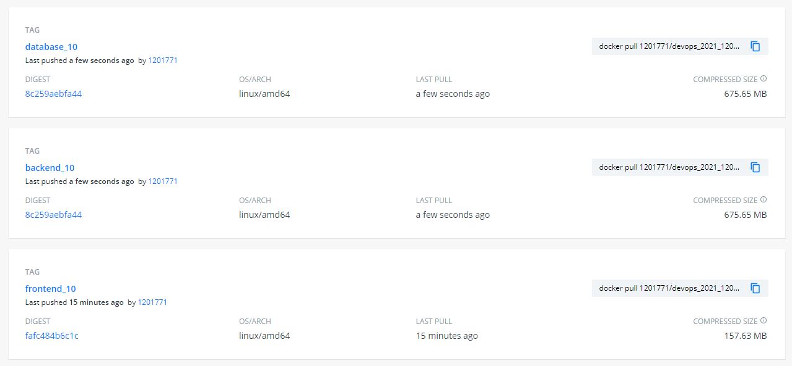

# READ ME DA TRACK6 #
___

## Objectivo ##
Num projecto gradle realizar testes smoke localmente da Applicação com Docker Containers. Publicar as imagens num repositório Docker Hub e, manualmente, colocá-las na cloud em funcionamento, usando servidores do isep.

## Desenvolvimento ##

### Criação de Dockerfiles ###

Tal como explicado anteriormente, o projecto foi compartimentalizado em 3 partes principais, de acordo com os três componentes principais da aplicação, ou seja, frontend, backend e base de dados (database). Assim, numa primeira fase foi necessário criar 3 Dockerfiles, cada um correspondente a cada um destes componentes, de forma a criar uma imagem que, mais tarde, vai criar cada container respectivo.

Cada um destes dockerfiles está contido numa package que lhe é correspondente, de forma a evitar entropias ao longo do processo. E, posteriormente, dentro de cada package colocou-se o Dockerfile correspondente. Estes directórios criados encontram-se dentro do package track6.

#### Dockerfile para a base de dados (database) ####

Para criar o container da base de dados, utilizou-se um ambiente do tipo Ubuntu e H2 Database Engine, uma vez que eram os requesitos do projecto envolvido neste trabalho.

    $ mkdir database
    $ ls
    README.md  database/

    $ pwd
    [...]/projecto_g2/devops_g2/tracks/track6/database
    $ nano Dokerfile

Segue-se o script correspondente ao Dockerfile da Database.

    ##DOCKERFILE_DATABASE
    ####
    # update environment
    FROM ubuntu
    # install unzip and wget
    RUN apt-get update && \
        apt-get install -y openjdk-8-jdk-headless && \
        apt-get install unzip -y && \
        apt-get install wget -y
    # create folder app
    RUN mkdir -p /usr/src/app
    # move to created folder /app
    WORKDIR /usr/src/app/
    # download h2 jar file
    RUN wget https://repo1.maven.org/maven2/com/h2database/h2/1.4.200/h2-1.4.200.jar
    # expose ports
    EXPOSE 8082
    EXPOSE 9092
    # run database (start database)
    CMD java -cp ./h2-1.4.200.jar org.h2.tools.Server -web -webAllowOthers -tcp -tcpAllowOthers -ifNotExists

#### Dockerfile para o Backend ####

Para criar o container do backend, utilizou-se um ambiente do tipo tomcat, um dos servidores mais utilizados para web server e java e Servlet COntainer para código em linguagem Java.

    $ mkdir backend
    $ cd backend/
    $ nano Dockerfile

Segue-se o script correspondente ao Dockerfile do Backend.

    ##Backend Dockerfile
    ####
    # create through tomcat environment
    FROM tomcat
    # update environment
    RUN apt-get update -y
    # intall ?
    RUN apt-get install -f
    # install java
    RUN apt-get install openjdk-11-jdk-headless -y
    # add jar to webapps directory
    ADD ./build/libs/project-1.0-SNAPSHOT.jar /usr/local/tomcat/webapps
    # add application-docker.properties to root directory
    ADD ./src/main/resources/application-production-docker.properties /root/
    # start application (with some configurations)
    CMD java -jar /usr/local/tomcat/webapps/project-1.0-SNAPSHOT.jar --spring.config.location=file:///root/application-production-docker.properties
    # define port
    EXPOSE 8080

NOTA: o último comando do scprit é um comando complexo uma vez que estamos a usar o mesmo repositório para todos os projetos de .
Cada projecto tem a sua própria configuração pelo que cada projecto tem o seu próprio application.properties,em que o que vai variar é o url da database.

Este comando é construido uma vez que o application properties utilizado nesta track utiliza o ficheiro application-production-docker.properties. Este ficheiro é semelhante a todos os outros, à excepção da propriedade abaixo referenciada.

    spring.datasource.url=jdbc:h2:tcp://192.168.33.11:9092/./jpadb;DB_CLOSE_DELAY=-1;DB_CLOSE_ON_EXIT=FALSE

#### Dockerfile para o Frontend ####

Finalmente, o container para o frontend utilizou-se um ambiente do tipo apache httpd, que é compatível com o protocolo http, onde as  funcionalidades são mantidas através de uma estrutura de módulos, permitindo inclusive que o utilizador escreva seus próprios módulos utilizando a API do software.

    $ pwd
    [...]/projecto_g2/devops_g2/tracks/track6
    $ mkdir frontend
    $ cd frontend
    $ nano Dockerfile

Segue-se o script correspondente ao Dockerfile do Backend.

    ##Dockerfile_Frontend
    ####
    # create through httpd enviroment
    FROM httpd
    # update
    RUN apt-get update -y
    # install
    RUN apt-get install -f
    # install node.js
    RUN apt-get install nodejs -y
    # install npm
    RUN apt-get install npm -y
    # copy build directory to /usr/local/apache2/htdocs/
    ADD ./frontend/build/ /usr/local/apache2/htdocs/
    # expose port
    EXPOSE 80

### Criação de docker-compose.yml file ###

Numa fase seginte, foi necessário criar o ficheiro docker-compose.yml, ferramenta esta que permite definir, configurar e correr multiplas aplicações de Docker Containers. Assim, no ficheiro configura-se os serviços de cada um dos componentes da aplicaçõe.
O docker-compose deve estar contido numa package ao nivel dos diretórios que contém cada um dos dockerfiles que este vai utilizar.

    $ ls -l
    total 4
    -rw-r--r-- 1 Switch 197121 2603 Jun 22 22:39 README.md
    drwxr-xr-x 1 Switch 197121    0 Jun 22 22:27 backend/
    drwxr-xr-x 1 Switch 197121    0 Jun 22 21:56 database/
    drwxr-xr-x 1 Switch 197121    0 Jun 22 22:53 frontend/
    $ nano docker-compose.yml

Segue-se a configuração do docker-compose adotado.

    version: '3'
    services:

    backend:
        build:
        context: ../../
        dockerfile: tracks/track6/backend/Dockerfile
        ports:
        - "80:8080"
        networks:
        default:
            ipv4_address: 192.168.33.10
        depends_on:
        - "database"

    database:
        build:
        context: ../../
        dockerfile: tracks/track6/database/Dockerfile
        ports:
        - "8082:8082"
        - "9092:9092"
        volumes:
        - ./data:/usr/src/data
        networks:
        default:
            ipv4_address: 192.168.33.11

    frontend:
        build:
        context: ../../
        dockerfile: tracks/track6/frontend/Dockerfile
        ports:
        - "8081:80"
        networks:
        default:
            ipv4_address: 192.168.33.12
        depends_on:
        - "backend"

    networks:
    default:
        ipam:
        driver: default
        config:
            - subnet: 192.168.33.0/24

### Criação do Jenkinsfile ###

Após todo o processo anterior estar predefinido, é agora a fase de criar a pipeline do Jenkins que vai correr o ficheiro docker-compose.yml. Segeu-se abaixo o script adotado para correr o Jenkins file.

    pipeline {
        agent any

        stages {
            stage('Checkout') {
                steps {
                    echo 'Checking out...'
                    git credentialsId: 'devops_1201771_credentials', url: 'https://marciagds@bitbucket.org/BVSousa90/devops_g2.git'
                }
            }
            stage('Assemble Backend') {
                steps {
                    echo 'Assembling...'
                        script {
                            if (isUnix()) {
                                echo 'gradle clean'
                                sh './gradlew clean'
                                echo 'gradle bootJar'
                                sh './gradlew clean bootJar'
                            }
                            else {
                                echo 'gradle clean'
                                bat './gradlew clean'
                                echo 'gradle bootJar'
                                bat './gradlew clean bootJar'
                            }
                        }
                }
            }
            stage('Assemble Frontend') {
                steps {
                    echo 'Assembling...'
                        dir("frontend/"){
                            script{
                                if (isUnix()){
                                    echo 'npm install'
                                    sh 'npm install'
                                    echo 'build front-end package'
                                    sh "REACT_APP_URL_API=http://192.168.33.10:8080 CI=false npm run build"
                                    }
                                else {
                                    echo 'npm install'
                                    bat 'npm install'
                                    echo 'build front/end package'
                                    bat "set 'REACT_APP_URL_API=http://localhost:80' CI=false && npm run build"
                                }
                            }
                        }
                }
            }
            stage('Javadoc') {
                steps {
                    echo 'Generating javadoc report...'
                    script {
                        if (isUnix())
                            sh './gradlew javadoc'
                        else
                        bat './gradlew javadoc'
                    echo 'Publishing javadoc report...'
                    publishHTML (target : [allowMissing: false,
                                alwaysLinkToLastBuild: true,
                                keepAll: true,
                                reportDir: 'build/docs/javadoc/',
                                reportFiles: 'index.html',
                                reportName: 'JavaDoc Report',
                                reportTitles: 'The Report'])
                    }
                }
            }

            stage('Test') {
                steps {
                        echo 'Testing...'
                        script {
                        if (isUnix())
                            sh './gradlew test'
                        else
                        bat './gradlew test'
                        }
                        junit 'build/test-results/test/*.xml'
                        jacoco(execPattern: 'build/jacoco/test.exec')
                    }
            }
            stage('Docker Image'){
                steps{
                    echo 'Building and pushing Image...'
                    dir('tracks/track6'){
                    script {
                        if (isUnix()) {
                            sh 'docker-compose build --no-cache'
                            sh 'docker-compose up -d'
                            echo "build number: ${env.BUILD_NUMBER}"
                            docker.withRegistry('','devops_docker_credentials'){
                                echo 'Pushing front-end image...'
                                sh "docker tag track6_frontend 1201771/devops_2021_1201771:frontend_${env.BUILD_NUMBER}"
                                sh "docker push 1201771/devops_2021_1201771:frontend_${env.BUILD_NUMBER}"
                                echo 'Pushing back-end image...'
                                sh "docker tag track6_backend 1201771/devops_2021_1201771:backend_${env.BUILD_NUMBER}"
                                sh "docker push 1201771/devops_2021_1201771:backend_${env.BUILD_NUMBER}"
                                echo 'Pushing database image...'
                                sh "docker tag track6_backend 1201771/devops_2021_1201771:database_${env.BUILD_NUMBER}"
                                sh "docker push 1201771/devops_2021_1201771:database_${env.BUILD_NUMBER}"
                                sh "docker push 1201771/devops_2021_1201771:database_${env.BUILD_NUMBER}"
                            }
                        }
                        else {
                            echo 'docker-compose build'
                            bat 'docker-compose build --no-cache'
                            echo 'docker-compose up'
                            //bat 'docker-compose up -d'
                            echo "build number: ${env.BUILD_NUMBER}"
                            docker.withRegistry('','devops_docker_credentials'){
                                echo 'Pushing front-end image...'
                                bat "docker tag track6_frontend 1201771/devops_2021_1201771:frontend_${env.BUILD_NUMBER}"
                                bat "docker push 1201771/devops_2021_1201771:frontend_${env.BUILD_NUMBER}"
                                echo 'Pushing back-end image...'
                                bat "docker tag track6_backend 1201771/devops_2021_1201771:backend_${env.BUILD_NUMBER}"
                                bat "docker push 1201771/devops_2021_1201771:backend_${env.BUILD_NUMBER}"
                                echo 'Pushing database image...'
                                bat "docker tag track6_backend 1201771/devops_2021_1201771:database_${env.BUILD_NUMBER}"
                                bat "docker push 1201771/devops_2021_1201771:database_${env.BUILD_NUMBER}"
                            }
                        }
                    }
                }
                }
            }
            stage('Archive') {
                steps {
                    echo 'Archiving...'
                    archiveArtifacts 'build/libs/*.jar'
                }
            }
        }
    }

Numa breve análise do script, verifica-se que o jenkinsfile é composto por várias stages. Numa primeira fase, começa-se por fazer clone do repositório onde se encontra o projecto. Para isso é necessário definir as credenciais no jenkins para acader ao repositório envolvido na stage. De seguida, começa-se por fazer um clean ao projecto, de forma a eliminar qualquer pasta desnecessária que possa estar no repositório e criar entropia ao longo do resto do progresso. Posteriormente, executa-se o comando para criar o ficheiro executável na aplicação. Neste caso, optou-se pelo ficheiro jar, unicamente pelo facto de ser um processo mais rápido. É de realçar que, tal como descrito nos objectivos, o projecto abordado é definido em gradle, utilizando-se por isso os comandos a partir do gradlew para não criar entropia na pipeline devido a possiveis diferenças nas versões usadas.

Outra nota importante, a pipeline foi cuidadosamente desenhada para ser utilizada por qualquer um dos sistemas operativos. Por essa razão, numa grande maioria das stages, optou-se por criar as condições propicias tanto para linux como outro sistema operativo.

De seguida, a 3ª stage consiste em preparar o frontend da aplicação. Para isso, começa-se por instalar todos os packages necessários e, posteriormente, criar o ficheiro estático build, que contém a informação necessária para correr o componente. Note-se que nesta fase existe uma condição adicional no que diz respeito a uma das contantes do componente. Isto acontece porque uma vez que o frontend faz pedidos para o backend, é necessário configurar o endereço para realizar os pedidos do http request. Nesta situação, para as situações não linux, é necessário não usar IPs, mas sim fazer um set para a port para o qual o pedido vai ser reencaminhado.

A 4ª satge consiste em criar o javadoc da aplicação e realizar a publicação do relatório obtido no jenkis. Esta stage é seguida pela dos testes, onde se correm todos os testes e se publica os resultados no Jenkins, mas também a informação de todo o coverage obtido como resultado deste comando.

Finalmente, e depois de todo o projecto estar funcional, inicia-se o trabalho com o Docker. Nesta stage, começa-se por correr o ficheiro docker-compose.yml, e, por consequencia, criar cada uma das imagens que, posteriormente, vão criar cada um dos containers respetivos de cada uma das partes da aplicação. Depois das imagens estarem criadas, faz-se o tag com a respetiva descrição, neste caso, <nome_do_componente>_<número da build do jenkins> e, de seguida, o push de cada uma dessas imagens.

Para terminar, a última stage consiste em armazenar o ficheiro executável da aplicação de backend no jenkins. Após fazer o build, todas as stages devem ser realizadas com sucesso, como demonstrado abaixo.

E as imagens criadas devem estar presentes no Docker Hub referenciado na pipeline.

### Smoke tests da Aplicação ###

De forma a testar se as imagens permitem construir containers estáveis e funcionais é possível correr localmente a aplicação. Para isso, corre-se localmente o docker-compose que iria ser implementado mais tarde no servidor, através do comando abaixo, na package onde se encontra o ficheiro docker-compose.yml.

    $ docker-compose up
    
O scrip deste docker-compose.yml encontra-se descrito abaixo.

    version: '3'
    services:

    backend:
        image: 1201771/devops_2021_1201771:backend_10
        ports:
        - "80:8080"
        networks:
        default:
            ipv4_address: 192.168.33.10
        depends_on:
        - "database"

    database:
        image: 1201771/devops_2021_1201771:database_10
        ports:
        - "8082:8082"
        - "9092:9092"
        volumes:
        - ./data:/usr/src/data
        networks:
        default:
            ipv4_address: 192.168.33.11

    frontend:
        image: 1201771/devops_2021_1201771:frontend_10
        ports:
        - "8081:80"
        networks:
        default:
            ipv4_address: 192.168.33.12
        depends_on:
        - "backend"

    networks:
    default:
        ipam:
        driver: default
        config:
            - subnet: 192.168.33.0/24

Após correr a aplicação, pode-se agora aceder ao link [http://localhost:80] e verificar se a aplicação está a funcionar.
Pelas imagens abaixo, verifica-se que é possível aceder à aplicação através do login.

Quando acede-se ao menú, verifica-se que o componente família encontra-se disponível e é possível criar e adicionar famílias.

E, que ainda é possível ver o perfil do administrador da família criada.

Finalmente, fazendo log out volta-se ao ínicio da applicação.

### Criação de um servidor ###

Após todas as imagens estarem corretamente configuradas e acessiveis no Docker Hub, começou-se a última fase da task. Assim, começou-se por criar um servidor a partir dos serviços disponibilizados pelo ISEP, criando-se um servidor do tipo Ubuntu 20.04 LTS Focal (base system). Este foi o selecionado uma vez que já vinha com algumas pre-configurações aquando a sua criação, nomeadamente o SSH e o Docker, uteis para a task em causa. Para este projecto, utilizou-se o servidor cessivel pelo link: [root@vs272.dei.isep.ipp.pt].

Note-se que para esta parte da task, onde as Docker images criadas são para enviar para o servidor, é necessário alterar o Jenkinsfile, nomeadamente na stage de criação do frontend. Segue-se assim, a configuração final do Jenkinsfile para a criação de Docker images que serão enviados para o servidor. Nesta situação, é necessário que o url seja configurado de acordo com o servidor do ISEP criado.

    pipeline {
        agent any

        stages {
            stage('Checkout') {
                steps {
                    echo 'Checking out...'
                    git credentialsId: 'devops_1201771_credentials', url: 'https://marciagds@bitbucket.org/BVSousa90/devops_g2.git'
                }
            }
            stage('Assemble Backend') {
                steps {
                    echo 'Assembling...'
                        script {
                            if (isUnix()) {
                                echo 'gradle clean'
                                sh './gradlew clean'
                                echo 'gradle bootJar'
                                sh './gradlew clean bootJar'
                            }
                            else {
                                echo 'gradle clean'
                                bat './gradlew clean'
                                echo 'gradle bootJar'
                                bat './gradlew clean bootJar'
                            }
                        }
                }
            }
            stage('Assemble Frontend') {
                steps {
                    echo 'Assembling...'
                        dir("frontend/"){
                            script{
                                if (isUnix()){
                                    echo 'npm install'
                                    sh 'npm install'
                                    echo 'build front-end package'
                                    sh "REACT_APP_URL_API=http://192.168.33.10:8080 CI=false npm run build"
                                    }
                                else {
                                    echo 'npm install'
                                    bat 'npm install'
                                    echo 'build front/end package'
                                    bat 'set "REACT_APP_URL_API=http://vs272.dei.isep.ipp.pt:80" CI=false && npm run build'
                                }
                            }
                        }
                }
            }
            stage('Javadoc') {
                steps {
                    echo 'Generating javadoc report...'
                    script {
                        if (isUnix())
                            sh './gradlew javadoc'
                        else
                        bat './gradlew javadoc'
                    echo 'Publishing javadoc report...'
                    publishHTML (target : [allowMissing: false,
                                alwaysLinkToLastBuild: true,
                                keepAll: true,
                                reportDir: 'build/docs/javadoc/',
                                reportFiles: 'index.html',
                                reportName: 'JavaDoc Report',
                                reportTitles: 'The Report'])
                    }
                }
            }

            stage('Test') {
                steps {
                        echo 'Testing...'
                        script {
                        if (isUnix())
                            sh './gradlew test'
                        else
                        bat './gradlew test'
                        }
                        junit 'build/test-results/test/*.xml'
                        jacoco(execPattern: 'build/jacoco/test.exec')
                    }
            }
            stage('Docker Image'){
                steps{
                    echo 'Building and pushing Image...'
                    dir('tracks/track6'){
                    script {
                        if (isUnix()) {
                            sh 'docker-compose build --no-cache'
                            sh 'docker-compose up -d'
                            echo "build number: ${env.BUILD_NUMBER}"
                            docker.withRegistry('','devops_docker_credentials'){
                                echo 'Pushing front-end image...'
                                sh "docker tag track6_frontend 1201771/devops_2021_1201771:frontend_${env.BUILD_NUMBER}"
                                sh "docker push 1201771/devops_2021_1201771:frontend_${env.BUILD_NUMBER}"
                                echo 'Pushing back-end image...'
                                sh "docker tag track6_backend 1201771/devops_2021_1201771:backend_${env.BUILD_NUMBER}"
                                sh "docker push 1201771/devops_2021_1201771:backend_${env.BUILD_NUMBER}"
                                echo 'Pushing database image...'
                                sh "docker tag track6_database 1201771/devops_2021_1201771:database_${env.BUILD_NUMBER}"
                                sh "docker push 1201771/devops_2021_1201771:database_${env.BUILD_NUMBER}"
                            }
                        }
                        else {
                            echo 'docker-compose build'
                            bat 'docker-compose build --no-cache'
                            echo 'docker-compose up'
                            //bat 'docker-compose up -d'
                            echo "build number: ${env.BUILD_NUMBER}"
                            docker.withRegistry('','devops_docker_credentials'){
                                echo 'Pushing front-end image...'
                                bat "docker tag track6_frontend 1201771/devops_2021_1201771:frontend_${env.BUILD_NUMBER}"
                                bat "docker push 1201771/devops_2021_1201771:frontend_${env.BUILD_NUMBER}"
                                echo 'Pushing back-end image...'
                                bat "docker tag track6_backend 1201771/devops_2021_1201771:backend_${env.BUILD_NUMBER}"
                                bat "docker push 1201771/devops_2021_1201771:backend_${env.BUILD_NUMBER}"
                                echo 'Pushing database image...'
                                bat "docker tag track6_database 1201771/devops_2021_1201771:database_${env.BUILD_NUMBER}"
                                bat "docker push 1201771/devops_2021_1201771:database_${env.BUILD_NUMBER}"
                            }
                        }
                    }
                }
                }
            }
            stage('Archive') {
                steps {
                    echo 'Archiving...'
                    archiveArtifacts 'build/libs/*.jar'
                }
            }
        }
    }

Após criar o servidor, foi então necessário enviar, de forma manual, as Docker images existentes no Docker Hub (anteriormente enviadas). Para isso, começou-se por aceder ao servidor por sftp e enviar para este o ficheiro docker-compose.yml descrito abaixo. Neste ficheiro, tem-se agora configurado as imagens, cuja descrição são as que se encontram no Docker Hub.

    version: '3'
    services:

    backend:
        image: 1201771/devops_2021_1201771:backend_11
        ports:
        - "80:8080"
        networks:
        default:
            ipv4_address: 192.168.33.10
        depends_on:
        - "database"

    database:
        image: 1201771/devops_2021_1201771:database_11
        ports:
        - "8082:8082"
        - "9092:9092"
        volumes:
        - ./data:/usr/src/data
        networks:
        default:
            ipv4_address: 192.168.33.11

    frontend:
        image: 1201771/devops_2021_1201771:frontend_11
        ports:
        - "8081:80"
        networks:
        default:
            ipv4_address: 192.168.33.12
        depends_on:
        - "backend"

    networks:
    default:
        ipam:
        driver: default
        config:
            - subnet: 192.168.33.0/24

Após enviar o docker-compose.yml file, através do comando:

    $ sftp root@vs272.dei.isep.ipp.pt
    root@vs272.dei.isep.ipp.pt's password: ...
    Connected to vs272.dei.isep.ipp.pt.
    sftp> lcd [...]DevOps\projecto_g2\devops_g2\tracks\track6\server
    sftp> put docker-compose.yml
    sftp> exit

Finalmente, no servidor, é apenas necessário correr o comando abaixo para que a aplicação fique funcional.

    $ docker compose up -d 

